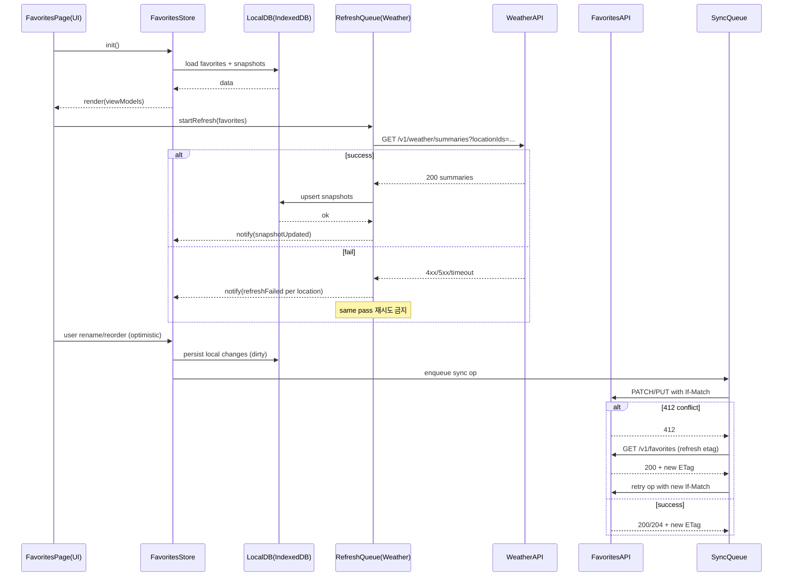

# Favorites 서버 동기화 설계 (아카이브)

이 문서는 `docs/specs-favorites.md`의 초기 버전에 있던 서버 API·ETag 기반 동시성 제어·IndexedDB 다중 오브젝트 스토어·로컬 SyncQueue 설계를 원문 그대로 보존한 것이다. 실제 구현에서는 이 중 어느 것도 만들어지지 않았으며, 즐겨찾기는 단일 기기 로컬 `localStorage` 저장소만으로 동작한다(`frontend/shared/lib/storage/repositories/location-repositories.ts`). 아래 내용은 변경 없이 원문 그대로 옮긴 것이며, 현재 시점에서 사실이 아니다 — 미래에 멀티 디바이스 동기화를 설계할 때 참고용으로만 남긴다.

---

## 로컬 저장소 선택 및 구조 (원래 설계: IndexedDB)

웹 클라이언트는 **IndexedDB**를 기본 저장소로 사용한다(대용량 구조화 데이터에 적합, 트랜잭션 제공). citeturn1search2turn1search14

**IndexedDB DB명(예시):** `app_weather_v1`

| Object Store | Key | 주요 필드 | 인덱스(권장) |
|---|---|---|---|
| `favorites` | `favoriteId` | `locationId, nickname, order, updatedAt, syncState` | `order`(정렬), `locationId`(중복 방지 조회) |
| `favoriteSnapshots` | `locationId` | 위 스냅샷 전체 | `fetchedAt` |
| `syncQueue` | `opId` | 오퍼레이션(추가/삭제/닉/정렬), 재시도 메타 | `nextRetryAt`, `type` |
| `recents` *(독립, 참고)* | `locationId` 또는 `recentId` | 최근 본 위치 | `lastOpenedAt` |

---

## SyncQueue(로컬 변경사항) 모델

즐겨찾기 변경(추가/삭제/닉/정렬)은 오프라인에서도 발생 가능하므로, 로컬에서 즉시 반영(Optimistic) 후 `syncQueue`에 적재한다.

**SyncOperation**
- `opId: string` (UUID)
- `type: "ADD" | "REMOVE" | "RENAME" | "REORDER"`
- `payload: object` (아래 예시)
- `createdAt: string`
- `attempt: int`
- `nextRetryAt: string | null`
- `lastError?: { at: string, code: string, httpStatus?: number }`

예시(정렬 변경):

```json
{
  "opId": "op_9b0a2f9c",
  "type": "REORDER",
  "payload": {
    "orderedFavoriteIds": ["fav_a", "fav_c", "fav_b"],
    "baseEtag": "\"favlist-etag-170\""
  },
  "createdAt": "2026-04-09T08:15:00+09:00",
  "attempt": 0,
  "nextRetryAt": null
}
```

---

## API 계약과 오류 코드

### HTTP/캐싱/조건부 요청 기본

- 조건부 요청의 핵심 헤더:
  - `ETag` / `If-None-Match`로 304 Not Modified 기반 캐시 재검증 가능 citeturn2search10turn2search3turn2search6
  - **업데이트 계열(정렬 저장 등)**은 `If-Match`로 “lost update”를 방지(낙관적 락) citeturn2search33turn6search10turn2search5
- 레이트리밋 대응:
  - 429 Too Many Requests는 레이트 리미팅을 의미하며 `Retry-After`를 포함할 수 있다. citeturn3search2turn3search6turn3search0
- 오류 포맷:
  - 문제 상세는 RFC 9457(Problem Details) 형태를 기본으로 한다. citeturn2search0turn2search1

### 엔드포인트 요약(권장 계약)

| 목적 | Method/Path | 요청 | 응답(성공) | 주요 실패 |
|---|---|---|---|---|
| 즐겨찾기 목록 조회 | `GET /v1/favorites` | 헤더: `If-None-Match?` | `200` + 리스트 + `ETag` / 또는 `304` | `401`, `500` |
| 즐겨찾기 추가 | `POST /v1/favorites` | `{ locationId, nickname? }` | `201` + Favorite + `ETag`(컬렉션) | `409(중복)`, `422`, `412`(옵션) |
| 즐겨찾기 삭제 | `DELETE /v1/favorites/{favoriteId}` | 헤더: `If-Match`(컬렉션 ETag) | `204` + `ETag`(컬렉션) | `404`, `412` |
| 닉네임 수정 | `PATCH /v1/favorites/{favoriteId}` | 헤더: `If-Match`(컬렉션 ETag) + `{ nickname }` | `200` + Favorite + `ETag` | `404`, `412`, `422` |
| 정렬 저장(일괄) | `PUT /v1/favorites/reorder` | 헤더: `If-Match`(컬렉션 ETag) + `{ orderedFavoriteIds }` | `200` + `{ favorites }` + `ETag` | `412`, `422` |
| 카드용 날씨 요약(배치) | `GET /v1/weather/summaries?locationIds=...` | 쿼리: 최대 N개 | `200` + `{ generatedAt, summaries[] }` | `400`, `429`, `503` |

> `PATCH` 메서드는 부분 수정을 위한 표준 메서드로 사용 가능하며, 멱등성은 구현 방식에 따라 달라질 수 있음을 유의한다. citeturn6search2turn6search13

### 요청/응답 스키마(예시)

**GET /v1/favorites** (200)

```json
{
  "favorites": [
    {
      "favoriteId": "fav_a",
      "locationId": "loc_3f2c1a8b",
      "nickname": "회사",
      "order": 0,
      "createdAt": "2026-03-01T10:00:00+09:00",
      "updatedAt": "2026-04-09T08:10:00+09:00"
    },
    {
      "favoriteId": "fav_b",
      "locationId": "loc_77aa21d0",
      "nickname": null,
      "order": 1,
      "createdAt": "2026-03-02T10:00:00+09:00",
      "updatedAt": "2026-04-09T08:10:00+09:00"
    }
  ],
  "collectionUpdatedAt": "2026-04-09T08:10:00+09:00"
}
```

헤더:
- `ETag: "favlist-etag-170"`

**PUT /v1/favorites/reorder**

요청 헤더:
- `If-Match: "favlist-etag-170"`

요청 바디:

```json
{ "orderedFavoriteIds": ["fav_b", "fav_a"] }
```

응답(200) + 헤더 `ETag: "favlist-etag-171"`:

```json
{
  "favorites": [
    { "favoriteId": "fav_b", "locationId": "loc_77aa21d0", "nickname": null, "order": 0, "updatedAt": "2026-04-09T08:15:00+09:00" },
    { "favoriteId": "fav_a", "locationId": "loc_3f2c1a8b", "nickname": "회사", "order": 1, "updatedAt": "2026-04-09T08:15:00+09:00" }
  ]
}
```

**GET /v1/weather/summaries** (200)

```json
{
  "generatedAt": "2026-04-09T08:12:00+09:00",
  "summaries": [
    {
      "locationId": "loc_3f2c1a8b",
      "observedAt": "2026-04-09T08:00:00+09:00",
      "tempC": 13.4,
      "conditionCode": "CLOUDY",
      "conditionText": "흐림",
      "todayMinC": 9.0,
      "todayMaxC": 17.0,
      "sketchKey": "CLOUDY_DAY"
    }
  ]
}
```

### 오류 응답 포맷: RFC 9457 Problem Details

RFC 9457은 HTTP API 오류를 기계가 읽을 수 있는 표준 구조로 전달하기 위한 포맷을 정의한다. citeturn2search0turn2search1

기본 구조(필수/권장 필드) + 확장 필드(`code`, `retryable`, `fields`)를 사용한다:

```json
{
  "type": "https://api.example.com/problems/validation-error",
  "title": "Validation error",
  "status": 422,
  "detail": "nickname must be <= 20 characters",
  "instance": "/v1/favorites/fav_a",
  "code": "FAV_NICKNAME_TOO_LONG",
  "retryable": false,
  "fields": [
    { "name": "nickname", "reason": "maxLength", "limit": 20 }
  ]
}
```

### 오류 코드/상태 코드 매핑(권장)

| 상황 | HTTP | code(예시) | retryable | 클라이언트 동작 |
|---|---:|---|---|---|
| 인증 만료/미인증 | 401 | AUTH_UNAUTHORIZED | false | 로그인/토큰 갱신 플로우 |
| 즐겨찾기 중복 추가 | 409 | FAV_ALREADY_EXISTS | false | UI에서 “이미 추가됨” 안내 |
| 닉네임 검증 실패 | 422 | FAV_NICKNAME_INVALID | false | 입력 유지 + 오류 메시지 |
| 정렬 충돌(ETag 불일치) | 412 | FAV_ETAG_MISMATCH | true | 최신 목록 재조회 후 머지/재시도 |
| 레이트 리밋 | 429 | RATE_LIMITED | true | `Retry-After` 준수 후 재시도 citeturn3search2turn3search6turn3search0 |
| 일시적 장애 | 503 | SERVICE_UNAVAILABLE | true | `Retry-After` 있으면 준수 citeturn3search0turn3search7 |

---

## 충돌(다중 기기) 해결: ETag + If-Match

정렬/삭제/닉 변경은 컬렉션 상태를 바꾸며 서로 충돌할 수 있다. 이를 위해:

- 서버는 `GET /v1/favorites` 응답에 컬렉션 `ETag`를 제공한다.
- 클라이언트는 업데이트 요청에 `If-Match: <lastKnownEtag>`를 포함한다. `If-Match`는 리소스 수정 시 “lost update” 문제를 방지하는 용도로 쓰일 수 있다. citeturn6search10turn2search33
- 불일치 시 서버는 `412 Precondition Failed`를 반환한다. citeturn2search5turn2search33

**412 처리 알고리즘(권장)**
1. 로컬의 pending operations(`syncQueue`)는 유지
2. `GET /v1/favorites`로 최신 상태와 새 ETag 획득
3. 로컬 변경을 “리베이스”:
   - `RENAME`: 동일 favoriteId에 대해 서버값 위에 로컬 rename을 다시 적용(가장 최근 로컬 커밋 우선)
   - `REORDER`: 최신 목록을 기준으로 로컬이 의도한 상대 순서를 재적용(가능하면 orderedFavoriteIds를 교집합에 대해 적용, 누락된 항목은 서버의 끝으로 유지)
   - `REMOVE`: 서버에 존재하면 제거 요청 재시도, 이미 없다면 op를 성공 처리(idempotent 취급)
4. 새 ETag로 `If-Match`를 갱신하고 재시도

---

## 컴포넌트 상호작용(mermaid)


