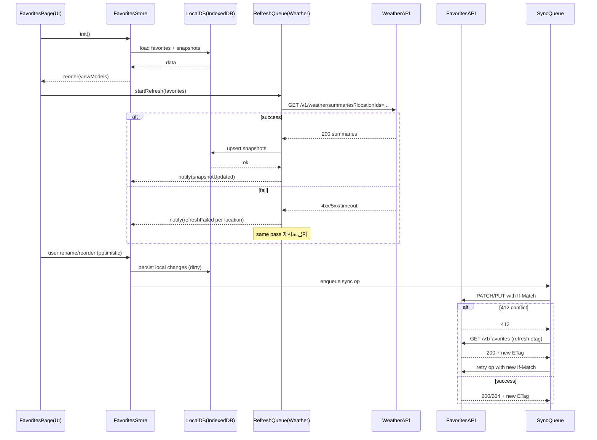

# Favorites 기능 개발자용 최종 명세서

## 경영 요약

본 문서는 이전 대화에서 확정된 **Favorites(즐겨찾기)** 기능을 “개발 즉시 착수 가능한 수준”으로 통합한 최종 명세다. 핵심 목표는 (1) 즐겨찾기 카드가 항상 **안정적인 레이아웃**을 유지하면서, (2) 온라인/오프라인 및 오류 상황에서도 **정직한 상태 표시(Last updated / Stale)**를 제공하고, (3) 정렬·별칭(닉네임) 편집을 **단일 ‘편집/정렬’ 모드**로 묶어 조작을 단순화하며, (4) 드래그 기반 정렬의 접근성 문제를 **위로/아래로 버튼 대안**으로 해결하는 것이다. 드래그 동작에 대해 단일 포인터 대안을 제공해야 한다는 접근성 요구(예: WCAG 2.2 SC 2.5.7)는 ‘위로/아래로’ 버튼으로 충족한다. citeturn0search1turn0search9

데이터/동기화 설계는 **로컬 영속 스냅샷(날씨 카드 스냅샷)**을 중심으로 한다. 스냅샷이 있는 경우 네트워크 실패에도 해당 스냅샷을 계속 보여주되 **stale 표시**를 한다. 스냅샷이 전혀 없는 상태에서 초기 로드가 실패하면 카드 슬롯은 유지하면서 **인라인 오류 + ‘다시 시도’ 버튼**을 보여주며, 이때는 **카드가 상세로 네비게이션되지 않는다**. 반대로 스냅샷이 존재하는 카드에서 갱신이 실패해도 카드는 네비게이션 가능 상태가 유지된다(단, stale 표시는 노출). 캐시/오프라인 전략은 “즉시성(캐시된 정보 즉시 렌더) + 백그라운드 갱신”의 **stale-while-revalidate** 성격을 따른다(개념적 적용). citeturn0search2turn0search30turn0search6

API 계약은 (1) 즐겨찾기 컬렉션 CRUD 및 정렬 저장, (2) 즐겨찾기 카드용 **날씨 요약 배치 조회**를 포함하며, 오류 응답은 표준화된 **Problem Details(RFC 9457)** 포맷을 기본으로 한다. citeturn2search0turn2search1 또한 동시 수정 충돌(다중 기기 정렬 경쟁 등)을 방지하기 위해 컬렉션 ETag + If-Match 기반의 **낙관적 동시성 제어**를 사용하며, 조건 불일치 시 412로 반응한다. citeturn2search33turn2search5turn6search10

마지막으로, **즐겨찾기 카드 갱신 큐**에서 특정 카드 갱신이 실패하더라도 같은 패스에서 “큐 레벨 추가 재시도”는 하지 않는다(즉시 재큐잉 금지). 대신 다음 패스(주기/트리거) 또는 사용자의 명시적 ‘다시 시도’로만 재시도한다.

---

## 범위와 전제

**범위(포함)**
- 즐겨찾기 목록 화면(기본 보기 + ‘편집/정렬’ 모드)
- 즐겨찾기 카드 렌더링(스ケ치/표시명/현재기온/상태문구/오늘 최저·최고/마지막 업데이트·stale)
- 별칭(닉네임) 편집(20자 하드 캡, blur/Enter 커밋, 완료 시 자동 blur 커밋)
- 정렬(드래그 핸들 + 위로/아래로 버튼 대안, 편집 모드에서만 노출)
- 로컬 영속 스냅샷 기반 오프라인/오류 복구
- 서버 동기화(정렬/별칭/추가·삭제), 충돌 해결

**범위(제외, 본 문서에서는 가정만 명시)**
- 위치 검색/수집(홈/검색/최근) 상세 UX
- 날씨 상세 화면의 전체 요구사항(즐겨찾기에서 상세 진입 시 라우팅만 가정)
- 스케치(일러스트) 생성 파이프라인/에셋 제작(키 규칙만 제시)
- 인증/권한/결제 등

**명시적 전제(Assumptions)**
- 클라이언트는 웹/모바일 중 하나 이상이며, 로컬 영속 저장소를 가진다. 웹은 **IndexedDB**를 1순위(대용량 구조화 데이터에 적합)로 사용한다. citeturn1search2turn1search6
- 즐겨찾기 목록은 사용자 계정 단위로 서버에 저장되며, 클라이언트는 Bearer Token 등 표준 인증 방식을 사용한다(구체 스킴은 백엔드 선택).
- Location은 `locationId`로 식별되며, `locationId`는 안정적이다(제3자 지오코딩을 쓰더라도 앱 내부에서 안정 ID를 부여한다고 가정).
- 날씨 카드에 필요한 데이터는 “요약 API”로 제공 가능하다고 가정한다(없다면 단건 API를 배치 호출해도 동작하나, 본 계약은 배치를 기준으로 최적화).
- 타임존은 Asia/Seoul이며, 상대 시간 표기는 로컬 타임존 기준으로 렌더한다.
- 오류 응답은 **RFC 9457 Problem Details**를 채택한다. citeturn2search0turn2search1
- HTTP 캐싱/조건부 요청(ETag/If-Match/If-None-Match, 304/412 등)은 표준 의미를 따른다. citeturn2search10turn2search3turn2search33turn2search5
- “드래깅 동작” 기능은 단일 포인터 대안 제공이 필요하므로(접근성), 정렬은 ‘위로/아래로’ 버튼을 제공한다. citeturn0search1turn0search9

---

## 확정 UX·UI 결정과 근거

아래 항목은 **확정(변경 금지)** 요구사항이다. 근거는 (a) 이전 대화에서의 결정, (b) 접근성/표준 근거(필요 시)로 구분한다.

| 결정 ID | 확정 결정(요구사항) | 근거/의도 |
|---|---|---|
| UX-01 | 즐겨찾기와 최근 위치는 **독립**이며 동일 위치가 양쪽에 모두 존재 가능 | “저장된 장소”와 “최근 본 장소”의 의미 분리, 사용자가 예측 가능 |
| UX-02 | 즐겨찾기 카드 콘텐츠 계약(MVP): **스케치 + 표시명/닉네임 + 현재기온 + 상태문구 + 오늘 최저/최고 + last-updated/stale 표시(필요 시)** | 정보 밀도/정직성(오프라인·지연 표시) 균형 |
| UX-03 | **스냅샷 없음 + 초기 로딩 중**: 카드 슬롯은 유지하고 **스켈레톤 카드 placeholder** 렌더 | 레이아웃 안정성, “비어있음” 혼란 방지 |
| UX-04 | **스냅샷 없음 + 초기 로드 실패**: 카드 슬롯 유지, **인라인 오류 상태** + **‘다시 시도’ 버튼** | 목록 전체 실패로 확장되는 것을 방지, 회복 가능성 제공 |
| UX-05 | UX-04 상태(스냅샷 없음+실패)에서는 **카드가 상세로 네비게이션되지 않음** | “표시할 신뢰 가능한 데이터 없음” 상태에서 이동을 막아 결정성 유지 |
| UX-06 | 정렬: 기본은 **드래그 핸들(pointer/touch)**, 접근성 대안은 **‘위로/아래로’ 버튼** | 드래그 대안 필요(단일 포인터 대안). WCAG 2.2 SC 2.5.7 취지에 부합 citeturn0search1turn0search9 |
| UX-07 | 드래그/위·아래 버튼은 **‘편집/정렬’ 모드에서만** 노출 | 기본 화면 정돈, 작업 의도를 명시 |
| UX-08 | 닉네임 편집은 **같은 ‘편집/정렬’ 모드**에 포함 | 관리 기능을 하나의 모드로 통합해 학습 비용↓ |
| UX-09 | 모드 진입/종료는 단일 토글: **‘편집’ ↔ ‘완료’** | MVP 단순성, 구현/테스트 용이 |
| UX-10 | ‘완료’ 탭 시 포커스된 닉네임 입력이 있으면 **자동 blur → 커밋 → 모드 종료** | 데이터 손실 방지, 결정성 |
| UX-11 | 닉네임은 **20자 하드 캡**(더 입력되지 않음) | 예측 가능 UX, 검증 단순화 |

**추가 UI 규칙(명세를 완결하기 위한 고정값)**
- 표시명 우선순위: `nickname`(비어있지 않음) → `locationName`.
- ‘편집/정렬’ 모드에서 카드 클릭(본문)은 기본적으로 상세로 이동하지 않으며(실수 방지), **명시적 “보기(chevron)”** 또는 모드 종료 후 이동을 권장(구현 간소화를 위해 MVP에서는 “편집 모드 중 카드 본문 클릭 = 이동 금지”로 고정하는 편이 테스트가 쉽다).
- “20자”의 정의: 기본은 **유니코드 그래프임(사용자 인지 문자)** 기준을 권장. 웹에서는 `Intl.Segmenter` 사용 가능 시 그래프임 기준으로 자르고, 불가 시 코드포인트 기준으로 자른다(이 규칙은 구현 난이도 대비 UX 품질이 높아 권장).

---

## 데이터 모델과 로컬 저장 전략

### 서버 도메인 엔티티

**Favorite**
- `favoriteId: string` (UUID 권장; UUID 일반 정의는 RFC 9562 참조) citeturn5search1
- `locationId: string`
- `nickname: string | null` (0~20자)
- `order: int` (0부터 연속; 서버는 정규화 보장)
- `createdAt: string` (ISO 8601)
- `updatedAt: string` (ISO 8601)

**FavoritesCollectionMeta**
- `etag: string` (HTTP ETag 헤더와 동일 의미; 조건부 요청에 사용) citeturn2search10turn2search33
- `updatedAt: string`

### 카드 스냅샷(로컬 영속) 엔티티

**FavoriteWeatherSnapshot (Persisted)**
- `locationId: string`
- `fetchedAt: string` (클라이언트가 API 응답 수신·확정한 시각)
- `observedAt: string` (서버/공급자가 제공하는 관측 시각; 없으면 `fetchedAt`로 대체)
- `tempC: number`
- `conditionCode: string` (예: `"CLEAR"`, `"RAIN"`, `"SNOW"` 등 내부 표준 코드)
- `conditionText: string` (예: `"맑음"`)
- `todayMinC: number`
- `todayMaxC: number`
- `sketchKey: string` (예: `"CLEAR_DAY"`, `"RAIN_NIGHT"` 등)
- `source: { provider: string, modelVersion?: string }`
- `lastError?: { at: string, type: string, httpStatus?: number }` (옵션)
- `schemaVersion: int` (마이그레이션용)

> 참고: “스케치”는 실제 이미지 바이너리를 저장하지 않고, 렌더링에 필요한 **키(sketchKey)**만 저장한다(앱 번들/에셋 카탈로그에서 키로 매핑).

### 로컬 저장소 선택 및 구조

웹 클라이언트는 **IndexedDB**를 기본 저장소로 사용한다(대용량 구조화 데이터에 적합, 트랜잭션 제공). citeturn1search2turn1search14

**IndexedDB DB명(예시):** `app_weather_v1`

| Object Store | Key | 주요 필드 | 인덱스(권장) |
|---|---|---|---|
| `favorites` | `favoriteId` | `locationId, nickname, order, updatedAt, syncState` | `order`(정렬), `locationId`(중복 방지 조회) |
| `favoriteSnapshots` | `locationId` | 위 스냅샷 전체 | `fetchedAt` |
| `syncQueue` | `opId` | 오퍼레이션(추가/삭제/닉/정렬), 재시도 메타 | `nextRetryAt`, `type` |
| `recents` *(독립, 참고)* | `locationId` 또는 `recentId` | 최근 본 위치 | `lastOpenedAt` |

### 예시 JSON: 로컬 영속 스냅샷

```json
{
  "locationId": "loc_3f2c1a8b",
  "fetchedAt": "2026-04-09T08:12:31+09:00",
  "observedAt": "2026-04-09T08:00:00+09:00",
  "tempC": 13.4,
  "conditionCode": "CLOUDY",
  "conditionText": "흐림",
  "todayMinC": 9.0,
  "todayMaxC": 17.0,
  "sketchKey": "CLOUDY_DAY",
  "source": { "provider": "ACME_WEATHER", "modelVersion": "2026.03" },
  "schemaVersion": 1
}
```

### SyncQueue(로컬 변경사항) 모델

즐겨찾기 변경(추가/삭제/닉/정렬)은 오프라인에서도 발생 가능하므로, 로컬에서 즉시 반영(Optimistic) 후 `syncQueue`에 적재한다.

**SyncOperation**
- `opId: string` (UUID)
- `type: "ADD" | "REMOVE" | "RENAME" | "REORDER"`
- `payload: object` (아래 예시)
- `createdAt: string`
- `attempt: int`
- `nextRetryAt: string | null`
- `lastError?: { at: string, code: string, httpStatus?: number }`

예시(정렬 변경):

```json
{
  "opId": "op_9b0a2f9c",
  "type": "REORDER",
  "payload": {
    "orderedFavoriteIds": ["fav_a", "fav_c", "fav_b"],
    "baseEtag": "\"favlist-etag-170\""
  },
  "createdAt": "2026-04-09T08:15:00+09:00",
  "attempt": 0,
  "nextRetryAt": null
}
```

---

## API 계약과 오류 코드

### HTTP/캐싱/조건부 요청 기본

- 조건부 요청의 핵심 헤더:
  - `ETag` / `If-None-Match`로 304 Not Modified 기반 캐시 재검증 가능 citeturn2search10turn2search3turn2search6
  - **업데이트 계열(정렬 저장 등)**은 `If-Match`로 “lost update”를 방지(낙관적 락) citeturn2search33turn6search10turn2search5
- 레이트리밋 대응:
  - 429 Too Many Requests는 레이트 리미팅을 의미하며 `Retry-After`를 포함할 수 있다. citeturn3search2turn3search6turn3search0
- 오류 포맷:
  - 문제 상세는 RFC 9457(Problem Details) 형태를 기본으로 한다. citeturn2search0turn2search1

### 엔드포인트 요약(권장 계약)

| 목적 | Method/Path | 요청 | 응답(성공) | 주요 실패 |
|---|---|---|---|---|
| 즐겨찾기 목록 조회 | `GET /v1/favorites` | 헤더: `If-None-Match?` | `200` + 리스트 + `ETag` / 또는 `304` | `401`, `500` |
| 즐겨찾기 추가 | `POST /v1/favorites` | `{ locationId, nickname? }` | `201` + Favorite + `ETag`(컬렉션) | `409(중복)`, `422`, `412`(옵션) |
| 즐겨찾기 삭제 | `DELETE /v1/favorites/{favoriteId}` | 헤더: `If-Match`(컬렉션 ETag) | `204` + `ETag`(컬렉션) | `404`, `412` |
| 닉네임 수정 | `PATCH /v1/favorites/{favoriteId}` | 헤더: `If-Match`(컬렉션 ETag) + `{ nickname }` | `200` + Favorite + `ETag` | `404`, `412`, `422` |
| 정렬 저장(일괄) | `PUT /v1/favorites/reorder` | 헤더: `If-Match`(컬렉션 ETag) + `{ orderedFavoriteIds }` | `200` + `{ favorites }` + `ETag` | `412`, `422` |
| 카드용 날씨 요약(배치) | `GET /v1/weather/summaries?locationIds=...` | 쿼리: 최대 N개 | `200` + `{ generatedAt, summaries[] }` | `400`, `429`, `503` |

> `PATCH` 메서드는 부분 수정을 위한 표준 메서드로 사용 가능하며, 멱등성은 구현 방식에 따라 달라질 수 있음을 유의한다. citeturn6search2turn6search13

### 요청/응답 스키마(예시)

**GET /v1/favorites** (200)

```json
{
  "favorites": [
    {
      "favoriteId": "fav_a",
      "locationId": "loc_3f2c1a8b",
      "nickname": "회사",
      "order": 0,
      "createdAt": "2026-03-01T10:00:00+09:00",
      "updatedAt": "2026-04-09T08:10:00+09:00"
    },
    {
      "favoriteId": "fav_b",
      "locationId": "loc_77aa21d0",
      "nickname": null,
      "order": 1,
      "createdAt": "2026-03-02T10:00:00+09:00",
      "updatedAt": "2026-04-09T08:10:00+09:00"
    }
  ],
  "collectionUpdatedAt": "2026-04-09T08:10:00+09:00"
}
```

헤더:
- `ETag: "favlist-etag-170"`

**PUT /v1/favorites/reorder**

요청 헤더:
- `If-Match: "favlist-etag-170"`

요청 바디:

```json
{ "orderedFavoriteIds": ["fav_b", "fav_a"] }
```

응답(200) + 헤더 `ETag: "favlist-etag-171"`:

```json
{
  "favorites": [
    { "favoriteId": "fav_b", "locationId": "loc_77aa21d0", "nickname": null, "order": 0, "updatedAt": "2026-04-09T08:15:00+09:00" },
    { "favoriteId": "fav_a", "locationId": "loc_3f2c1a8b", "nickname": "회사", "order": 1, "updatedAt": "2026-04-09T08:15:00+09:00" }
  ]
}
```

**GET /v1/weather/summaries** (200)

```json
{
  "generatedAt": "2026-04-09T08:12:00+09:00",
  "summaries": [
    {
      "locationId": "loc_3f2c1a8b",
      "observedAt": "2026-04-09T08:00:00+09:00",
      "tempC": 13.4,
      "conditionCode": "CLOUDY",
      "conditionText": "흐림",
      "todayMinC": 9.0,
      "todayMaxC": 17.0,
      "sketchKey": "CLOUDY_DAY"
    }
  ]
}
```

### 오류 응답 포맷: RFC 9457 Problem Details

RFC 9457은 HTTP API 오류를 기계가 읽을 수 있는 표준 구조로 전달하기 위한 포맷을 정의한다. citeturn2search0turn2search1

기본 구조(필수/권장 필드) + 확장 필드(`code`, `retryable`, `fields`)를 사용한다:

```json
{
  "type": "https://api.example.com/problems/validation-error",
  "title": "Validation error",
  "status": 422,
  "detail": "nickname must be <= 20 characters",
  "instance": "/v1/favorites/fav_a",
  "code": "FAV_NICKNAME_TOO_LONG",
  "retryable": false,
  "fields": [
    { "name": "nickname", "reason": "maxLength", "limit": 20 }
  ]
}
```

### 오류 코드/상태 코드 매핑(권장)

| 상황 | HTTP | code(예시) | retryable | 클라이언트 동작 |
|---|---:|---|---|---|
| 인증 만료/미인증 | 401 | AUTH_UNAUTHORIZED | false | 로그인/토큰 갱신 플로우 |
| 즐겨찾기 중복 추가 | 409 | FAV_ALREADY_EXISTS | false | UI에서 “이미 추가됨” 안내 |
| 닉네임 검증 실패 | 422 | FAV_NICKNAME_INVALID | false | 입력 유지 + 오류 메시지 |
| 정렬 충돌(ETag 불일치) | 412 | FAV_ETAG_MISMATCH | true | 최신 목록 재조회 후 머지/재시도 |
| 레이트 리밋 | 429 | RATE_LIMITED | true | `Retry-After` 준수 후 재시도 citeturn3search2turn3search6turn3search0 |
| 일시적 장애 | 503 | SERVICE_UNAVAILABLE | true | `Retry-After` 있으면 준수 citeturn3search0turn3search7 |

---

## 캐시·오프라인·스테일 규칙과 카드 렌더링 상태

### 캐시/오프라인 전략(공식)

1) **로컬 영속 스냅샷 우선 렌더**
- 즐겨찾기 화면 진입 시, (a) 즐겨찾기 목록 로드, (b) 각 location의 스냅샷을 로드하여 즉시 렌더한다.
- 이 전략은 “캐시된 콘텐츠를 즉시 제공하고 백그라운드에서 갱신”하는 **stale-while-revalidate** 개념과 동일한 UX 목표(즉시성+최신성 균형)를 가진다. citeturn0search2turn0search30turn0search6

2) **스냅샷이 없으면 스켈레톤**
- UX-03 적용.

3) **초기 로드 실패 + 스냅샷 없음이면 인라인 오류 + 다시 시도**
- UX-04/05 적용.

4) **갱신 실패 + 스냅샷 있음이면 스냅샷 유지 + stale 표시**
- 목록 전체 실패로 확장하지 않고, 카드별로 신뢰도를 표기한다(“정직한 UI”).

5) **(확정) 즐겨찾기 카드 갱신 큐 정책**
- 한 번의 갱신 패스에서 특정 카드가 실패하더라도 **그 자리에서 큐 레벨로 즉시 재시도하지 않는다**(재큐잉 금지).
- 재시도는 (a) 사용자 ‘다시 시도’, (b) 다음 주기 패스, (c) 앱 재진입/포그라운드 트리거에서만 발생.

### Stale(오래됨) 판정 규칙(고정값)

날씨 데이터는 업데이트 주기가 짧으므로, 아래 상수를 MVP 고정값으로 둔다(필요 시 원격 설정 가능):

- `FRESH_TTL = 10분`
- `STALE_TTL = 60분` (60분 초과는 “매우 오래됨”으로 별도 뱃지)

판정:
- `now - fetchedAt <= 10분` → Fresh (기본 last-updated만, stale 뱃지 없음)
- `10분 < now - fetchedAt <= 60분` → Stale (작은 “오래됨”/“지연” 표기)
- `> 60분` → Very Stale (더 강한 표기 + “업데이트 지연” 문구)

오프라인:
- 네트워크 불가일 때도 스냅샷이 있으면 표시하되, stale 표기와 함께 “오프라인” 라벨을 추가한다.

### Last-updated 표시 포맷(고정값)

- 1분 미만: “방금”
- 1분~59분: “N분 전”
- 1시간~23시간: “N시간 전”
- 그 이상: “YYYY.MM.DD HH:mm”

### UI 상태 매트릭스(공식 렌더링)

| 스냅샷 | 네트워크 | 요청 상태 | 카드 표시 | ‘다시 시도’ | 네비게이션 |
|---|---|---|---|---|---|
| 없음 | 온라인 | 초기 로딩 | 스켈레톤 카드 | 없음 | 불가 |
| 없음 | 온라인 | 초기 실패 | 인라인 오류(문구+버튼) | 표시 | 불가(UX-05) |
| 없음 | 오프라인 | 초기 불가 | 인라인 오류(오프라인 안내+버튼 비활성 또는 “연결 후 시도”) | 표시(조건부) | 불가 |
| 있음 | 온라인 | 백그라운드 갱신 중 | 스냅샷 + last-updated (필요 시 로딩 인디케이터 미세 표시) | 없음 | 가능 |
| 있음 | 온라인 | 갱신 실패 | 스냅샷 + stale/매우오래됨 + lastError(선택) | (선택) 카드 내부 작은 재시도 링크 가능하나 MVP는 페이지/주기 갱신으로도 충분 | 가능 |
| 있음 | 오프라인 | 갱신 불가 | 스냅샷 + 오프라인 + stale | 없음 | 가능 |

### 초기 로드/재시도 타임라인(mermaid)

```mermaid
flowchart TD
  A[Favorites 화면 진입] --> B[로컬 favorites 목록 로드]
  B --> C{각 favorite별 snapshot 존재?}
  C -->|예| D[스냅샷 즉시 렌더]
  C -->|아니오| E[스켈레톤 렌더]

  D --> F{온라인?}
  E --> F

  F -->|예| G[갱신 큐에 refresh 요청 enqueue]
  F -->|아니오| H[오프라인: 스냅샷 있으면 stale+오프라인 표시 / 없으면 인라인 오류]

  G --> I{API 성공?}
  I -->|예| J[스냅샷 저장/업데이트 -> UI 갱신]
  I -->|아니오| K{스냅샷 있었나?}
  K -->|예| L[기존 스냅샷 유지 + stale 표시 (같은 패스에서 재큐잉 금지)]
  K -->|아니오| M[인라인 오류 + '다시 시도' 버튼, 네비게이션 비활성]

  M --> N['다시 시도' 클릭]
  N --> O{온라인?}
  O -->|예| G
  O -->|아니오| H
```

---

## 정렬·닉네임 편집·동기화 및 충돌 해결

### ‘편집/정렬’ 모드 동작(공식)

- 진입: 상단 토글 버튼 “편집”
- 종료: 같은 버튼이 “완료”로 바뀌며, 탭 시 모드를 종료
- 노출 요소(편집 모드에서만):
  - 드래그 핸들
  - `위로` / `아래로` 버튼(접근성 대안)
  - 닉네임 입력 필드(또는 인라인 편집 UI)

### 정렬 UI 상세 규칙

- `위로` 버튼: `order == 0`이면 disabled
- `아래로` 버튼: `order == last`이면 disabled
- 드래그 이동 중에는 드롭 위치를 시각적으로 표시(placeholder bar 등)
- 정렬 변경은 즉시 UI에 반영(optimistic), 로컬 `favorites.order`를 업데이트하고 “dirty” 플래그를 세운다.

**접근성 근거**
- 드래그로만 정렬 가능한 UI는 드래깅 대안을 요구하는 성공 기준 취지에 부합하지 않으므로(특히 운동장애 사용자), 동일 기능을 버튼으로 제공한다. citeturn0search1turn0search9
- 모든 기능은 키보드로 조작 가능해야 하며(키보드 접근성), 버튼 기반 대안은 이를 충족하는 가장 단순한 형태다. citeturn4search7turn4search0

### 닉네임 편집 규칙(공식)

- 입력 제한: 20자 하드 캡(더 입력되지 않음) (UX-11)
- 커밋: Enter 또는 blur 시 저장(또는 “완료” 탭 시 자동 blur 후 커밋) (UX-10)
- 빈 문자열 허용: 빈 값이면 nickname을 `null`로 저장(표시명은 locationName으로 폴백)
- 서버 전송 시 검증 실패(422)면: 입력 필드는 사용자가 수정 가능하도록 유지하되, 에러 문구를 표시한다(커밋 실패이므로 로컬도 롤백하거나 “pending error” 상태로 표시—MVP에서는 **롤백(이전 값 복원)**을 권장: 테스트가 단순).

### 정렬/닉네임 서버 저장 타이밍(권장 고정)

- 닉네임: 커밋 이벤트(blur/Enter/완료)마다 `syncQueue`에 `RENAME` 적재 후 즉시 동기화 시도(온라인이면).
- 정렬: 편집 모드에서 순서 변경이 일어나면 로컬 반영 후, (a) 800ms 디바운스 또는 (b) “완료” 탭 시점에 `REORDER` 1회 호출. **MVP 권장**은 “완료 시 1회 호출”이다(요청 수↓, 구현·테스트 단순).  
  - 단, 화면 이탈/앱 백그라운드로 전환 시 “dirty order”가 있으면 즉시 로컬은 유지하고 `syncQueue`에 남긴다(다음 온라인에서 반영).

### 충돌(다중 기기) 해결: ETag + If-Match

정렬/삭제/닉 변경은 컬렉션 상태를 바꾸며 서로 충돌할 수 있다. 이를 위해:

- 서버는 `GET /v1/favorites` 응답에 컬렉션 `ETag`를 제공한다.
- 클라이언트는 업데이트 요청에 `If-Match: <lastKnownEtag>`를 포함한다. `If-Match`는 리소스 수정 시 “lost update” 문제를 방지하는 용도로 쓰일 수 있다. citeturn6search10turn2search33
- 불일치 시 서버는 `412 Precondition Failed`를 반환한다. citeturn2search5turn2search33

**412 처리 알고리즘(권장)**
1. 로컬의 pending operations(`syncQueue`)는 유지
2. `GET /v1/favorites`로 최신 상태와 새 ETag 획득
3. 로컬 변경을 “리베이스”:
   - `RENAME`: 동일 favoriteId에 대해 서버값 위에 로컬 rename을 다시 적용(가장 최근 로컬 커밋 우선)
   - `REORDER`: 최신 목록을 기준으로 로컬이 의도한 상대 순서를 재적용(가능하면 orderedFavoriteIds를 교집합에 대해 적용, 누락된 항목은 서버의 끝으로 유지)
   - `REMOVE`: 서버에 존재하면 제거 요청 재시도, 이미 없다면 op를 성공 처리(idempotent 취급)
4. 새 ETag로 `If-Match`를 갱신하고 재시도

---

## 접근성·관측성·보안/프라이버시·테스트 계획과 체크리스트

### 접근성 요구사항(필수)

- 드래그 정렬에는 **단일 포인터 대안**이 있어야 하며, 본 기능은 `위로/아래로` 버튼으로 충족한다. citeturn0search1turn0search9
- 모든 조작(편집 진입/종료, 위/아래 이동, 닉네임 입력 커밋)은 키보드로 가능해야 한다(버튼/입력은 기본적으로 키보드 조작 가능). citeturn4search7turn4search0
- 포커스 가시성/순서:
  - 탭 순서: “편집/완료” → 카드(또는 카드 내부 컨트롤) → 다음 카드
  - 편집 모드에서 컨트롤이 노출될 때 포커스가 예측 가능한 위치에 나타나야 한다.
- 스크린리더 라벨:
  - `위로` 버튼 accessible name: “즐겨찾기 {표시명} 위로 이동”
  - `아래로` 버튼 accessible name: “즐겨찾기 {표시명} 아래로 이동”
  - `다시 시도` 버튼: “{표시명} 날씨 다시 시도”
- ARIA 드래그 속성에 대한 주의:
  - `aria-grabbed`, `aria-dropeffect`는 ARIA 1.1에서 deprecated로 안내된 바 있으며, Authoring Practices에서도 관련 섹션이 제거된 이력이 있으므로, MVP에서는 **해당 속성에 의존하지 않는다**. citeturn4search5turn4search9

### 텔레메트리/메트릭(권장 수집)

**이벤트(예시)**
- `favorites_view` (props: count, hasOfflineData, loadTimeMs)
- `favorite_add` (props: locationIdHash, sourceSurface)
- `favorite_remove`
- `favorite_rename_commit` (props: length, method: blur|enter|done)
- `favorite_reorder` (props: method: drag|updown, movesCount)
- `favorite_card_refresh_attempt` (props: batchSize, trigger: open|resume|timer|retryBtn)
- `favorite_card_refresh_result` (props: success, httpStatus?, errorCode?, latencyMs)
- `favorite_card_state_exposed` (props: state: skeleton|error|stale|fresh, ageMin)

**핵심 지표**
- 즐겨찾기 화면 TTI(첫 카드 렌더까지)
- 배치 날씨 요약 API p50/p95 latency, 실패율(4xx/5xx/timeout)
- 스냅샷 없이 초기 실패 비율(가장 UX에 치명적)
- 정렬/닉 변경 동기화 지연 시간(로컬 커밋→서버 확정)
- 412(충돌) 발생률 및 자동 복구 성공률

### 보안/프라이버시 고려

- 위치 정보(특히 좌표/정확한 주소)는 민감 데이터다. 즐겨찾기/스냅샷 로컬 저장에는 최소한의 식별자(`locationId`)만 저장하고, 분석 이벤트에는 원본 ID 대신 해시/익명화 값을 사용한다.
- 로그아웃/계정 전환 시 로컬에 남아있는 캐시/스토리지 삭제가 필요하다. 웹에서는 서버가 `Clear-Site-Data` 헤더로 캐시·쿠키·스토리지(IndexedDB 포함) 삭제를 지시할 수 있다. citeturn1search28
- 네트워크 오류/서버 오류의 상세 `detail`은 개인정보(주소 문자열, 좌표 등)를 포함하지 않도록 서버·클라이언트 모두 필터링한다(RFC 9457 확장 필드 사용 시 특히 주의). citeturn2search0turn2search1

### 구현 체크리스트

**UI**
- [ ] 즐겨찾기 카드 컴포넌트: Fresh/Stale/VeryStale/Offline 표기 포함
- [ ] 스켈레톤 카드 상태 구현(스냅샷 없음+로딩)
- [ ] 인라인 오류 상태 구현(스냅샷 없음+실패) + `다시 시도` + 네비게이션 차단
- [ ] ‘편집/완료’ 토글 + 편집 모드 전용 컨트롤 표시
- [ ] 닉네임 입력 20자 하드 캡 + blur/Enter/Done 커밋

**데이터/스토리지**
- [ ] IndexedDB 스키마 생성 및 마이그레이션(스냅샷 schemaVersion)
- [ ] favorites/order 저장 및 정규화(0..n-1)
- [ ] snapshot 저장/로드, lastError 저장

**네트워크/동기화**
- [ ] `GET /v1/favorites` ETag 기반 304 처리(선택)
- [ ] 정렬/닉 PATCH/PUT에 If-Match 적용, 412 처리(리베이스)
- [ ] 날씨 요약 배치 호출 + 부분 실패 처리(가능하면 location별 에러 포함)
- [ ] 429/503에서 Retry-After 준수(있을 때) citeturn3search2turn3search0turn3search7
- [ ] “카드 갱신 큐”는 동일 패스에서 실패 항목 재큐잉 금지

**접근성**
- [ ] 위/아래 버튼의 라벨/disabled 상태 점검
- [ ] 편집 모드에서 포커스 이동 및 포커스 가시성 확인
- [ ] 드래그 속성(aria-grabbed 등) 미사용 확인 citeturn4search5turn4search9

### 테스트 계획(핵심 케이스)

| 레벨 | 케이스 | 시나리오 | 기대 결과 |
|---|---|---|---|
| Unit | 닉네임 20자 하드캡 | 21자 입력 시도 | 20자에서 입력 중단, 예외 없음 |
| Unit | 커밋 규칙 | Enter/blur/완료 | 저장 함수 1회 호출, 값 일관 |
| Unit | 스테일 판정 | fetchedAt 조작 | 10분/60분 경계에서 상태 정확 |
| Integration | 스냅샷 없음 초기 로드 실패 | API 500, 로컬 empty | 인라인 오류+다시 시도, 카드 네비게이션 불가 |
| Integration | 스냅샷 있음 갱신 실패 | 로컬 snapshot, API timeout | 스냅샷 유지 + stale 표시, 네비게이션 가능 |
| Integration | 갱신 큐 재시도 정책 | 첫 호출 실패 | 동일 패스에서 자동 재큐잉 금지(호출 횟수 1회) |
| Integration | 429 + Retry-After | 서버 429 반환 | Retry-After 시간 이후 재시도 citeturn3search2turn3search0 |
| Integration | 412 충돌 리베이스 | If-Match 구버전 | 최신 목록 재조회 후 재적용, 최종 성공 |
| E2E | 편집 모드 노출 | 편집 버튼 클릭 | 드래그/위아래/닉 입력이 나타남, 완료 시 숨김 |
| E2E | 위/아래 정렬 | 첫 항목 위로 | disabled, 동작 없음 |
| E2E | “완료” 자동 blur 커밋 | 입력 중 완료 클릭 | 값 저장 후 모드 종료 |
| A11y | 키보드 조작 | Tab/Enter로 편집·위아래·완료 | 마우스 없이 동일 기능 수행 citeturn4search7turn4search0 |
| A11y | 드래그 대안 | 드래그 없이 정렬 | 위/아래로 재정렬 가능(드래그 대안 충족) citeturn0search1turn0search9 |
| Offline | 오프라인 진입 | 스냅샷 있는 상태에서 offline | 스냅샷 표시+오프라인/스테일, 크래시 없음 |
| Offline | 오프라인에서 변경 후 복귀 | 오프라인 rename/reorder | 로컬 반영 유지, 온라인 복귀 후 syncQueue 소진 |

### 컴포넌트 상호작용(mermaid)



