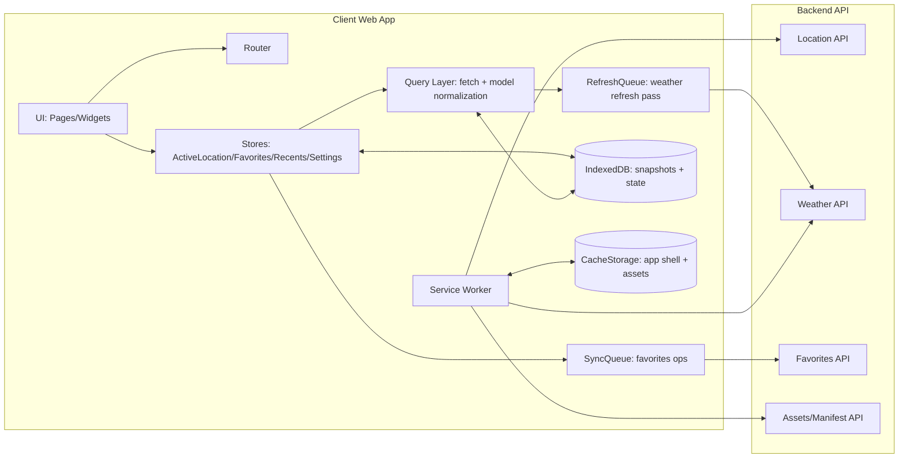
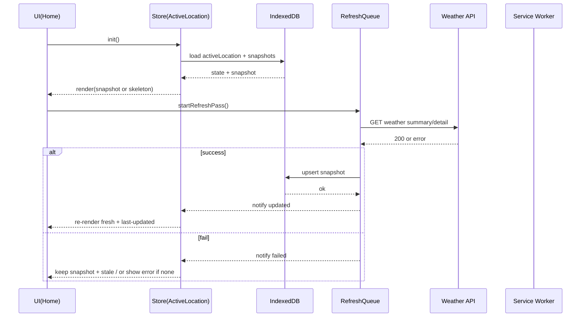
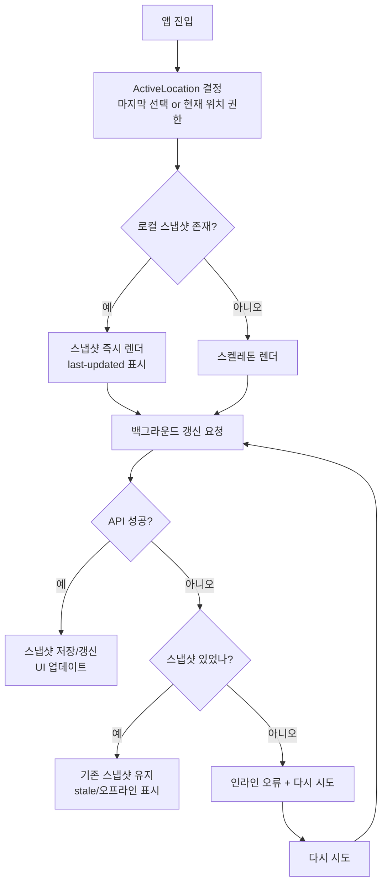

# Weatherpane 프로젝트 통합 개발자 명세서

## 경영 요약

Weatherpane는 **대한민국 지역을 중심으로** 사용자에게 “현재 위치(또는 선택한 위치)”의 날씨를 빠르게 제공하고, 오프라인·불안정 네트워크에서도 **영속 스냅샷(persisted snapshot)** 기반으로 **마지막 업데이트 시각/오래됨(stale)**을 정직하게 표시하는 것을 핵심 가치로 한다. 앱은 **홈(Active Location)**을 중심으로 **검색(Search)**, **상세(Weather Detail)**, **즐겨찾기(Favorites)**, **최근(Recents)**, **설정(Settings)**으로 구성되며, 정적 에셋(스케치)과 동적 데이터(날씨) 모두에 대해 **캐시/스냅샷/서비스워커**를 조합한 “즉시성 + 최신성” 균형을 목표로 한다. 서비스 워커는 웹 앱·브라우저·네트워크 사이의 프록시 역할로 오프라인 경험을 가능하게 한다. citeturn1search3

본 문서는 사용자와의 이전 대화에서 확정된 **Favorites UX 결정**(카드 스켈레톤/인라인 오류/재시도/비네비게이션/편집 모드/위·아래 버튼/닉네임 20자 하드캡 등)을 **“변경 금지(확정)”**로 고정하고, 그 외 화면/기능은 “MVP 가정(Assumptions)”과 “권장 설계(Recommendations)”를 명확히 구분해 개발자가 즉시 구현 가능한 수준의 **아키텍처·데이터 모델·API 계약·오프라인 전략·테스트 계획**을 통합한다. API 오류 포맷은 표준화된 Problem Details(RFC 9457)를 기본으로 하여 클라이언트/테스트/관측을 단순화한다. citeturn0search2

---

## 제품 범위와 우선순위

### 제품 범위

Weatherpane의 기능 범위는 다음 8개 축으로 정리한다.

- **Home / Active Location**: 앱 진입 시 “현재 위치 또는 마지막 선택 위치”의 요약 카드 및 주요 탐색 허브.
- **Search**: 대한민국 위치를 빠르게 찾고, 선택 시 Active Location으로 전환.
- **Weather Detail**: 선택 위치의 상세 예보(시간별/일별)와 보조 지표(습도/풍속 등).
- **Favorites**: 자주 보는 위치를 저장/정렬/별칭(닉네임) 관리, 홈에서 빠르게 접근.
- **Recents**: 최근 조회한 위치 목록(즐겨찾기와 독립).
- **Settings**: 단위/테마/데이터 관리(캐시 삭제 등).
- **Offline behavior**: 스냅샷 기반 렌더, stale/오프라인 표시, 실패 복구 UX.
- **Assets / Sketch pipeline**: 상태(맑음/비/눈 등)와 주야에 따른 스케치 키-에셋 매핑 및 캐시.

### MVP 우선순위(권장)

| 우선순위 | 기능 | MVP 목표 | 비고 |
|---|---|---|---|
| P0 | Home/Active Location | 즉시 렌더 + 스냅샷 fallback + stale 표시 | 오프라인 핵심 |
| P0 | Search | 위치 선택 → Active Location 전환 + Recents 기록 | 검색 데이터 소스는 가정 필요 |
| P0 | Weather Detail | 최소한 “현재/시간별/일별” 표시 + 오류/스켈레톤 | 데이터 계약 필요 |
| P0 | Favorites | **확정 UX** 준수(편집/정렬, 위·아래, 스켈레톤/오류 등) | 본 문서에서 고정 |
| P1 | Settings | 테마/단위 + 캐시/로컬 데이터 초기화 | 개인정보/보안과 연계 |
| P1 | Service Worker | 앱 셸 precache + 런타임 캐시 | PWA 캐싱 권장 citeturn0search3 |
| P2 | 원격 스케치 매니페스트 | 다음 세션에 적용되는 원격 오버라이드 | 운영 편의 |
| P2 | 고급 오프라인 동기화 | Periodic Background Sync 등 | 브라우저 지원 고려 citeturn5search2turn5search6 |

### 명시적 전제(Assumptions)

아직 대화로 확정되지 않은 항목은 아래 전제로 두고, 실제 프로젝트 상황에 따라 조정한다.

- **백엔드 기술/호스팅**: 불명(REST 기준으로 계약 정의).
- **인증 방식**: Bearer token(OAuth2/OIDC 등) 가정. (마이페이지/멀티 디바이스 동기화가 필요할 때만 필수)
- **검색 데이터 소스**: (A) 로컬 내장 대한민국 지명 카탈로그(권장) 또는 (B) 서버/서드파티 지오코딩 API.
- **날씨 공급자**: (A) 자체 백엔드 집계(권장) 또는 (B) 클라이언트 직접 서드파티 호출(권장하지 않음: 키 노출/쿼터).
- **플랫폼**: 웹(PWA) 우선. 서비스 워커/Geolocation은 HTTPS 보안 컨텍스트 전제. citeturn1search3turn6search0

---

## UX 결정과 화면 상태

### 확정 UX 결정 로그

아래 “확정” 항목은 이전 대화에서 합의된 Favorites 규칙으로, 변경 시 반드시 PR에서 명시적으로 재합의해야 한다.

| ID | 결정(확정) | 근거 |
|---|---|---|
| FAV-01 | Favorites와 Recents는 **독립**이며 동일 위치가 양쪽에 존재 가능 | “저장한 장소” vs “최근 본 장소” 의미 분리 |
| FAV-02 | Favorite 카드 콘텐츠 계약(MVP): **스케치 + 표시명/닉네임 + 현재기온 + 상태문구 + 오늘 최저/최고 + last-updated/stale(필요 시)** | 카드 정보 밀도와 정직성 균형 |
| FAV-03 | **스냅샷 없음 + 로딩 중**: 카드 슬롯 유지, **스켈레톤** 표시 | 레이아웃 안정 |
| FAV-04 | **스냅샷 없음 + 초기 실패**: 카드 슬롯 유지, **인라인 오류 상태** 표시 | 전체 화면 실패로 확장 방지 |
| FAV-05 | FAV-04 상태에서 **‘다시 시도’ 버튼** 제공 | 회복 가능 UX |
| FAV-06 | FAV-04 상태에서는 **카드 네비게이션 불가** | 신뢰 가능한 표시 데이터 없음 |
| FAV-07 | 정렬은 포인터/터치 **드래그 핸들** + 접근성 대안 **‘위로/아래로’ 버튼** | 드래그 대안 요구에 부합 citeturn0search0 |
| FAV-08 | 드래그/위·아래/닉네임 편집은 **‘편집/정렬’ 모드에서만** 노출 | 기본 UI 단정 |
| FAV-09 | 모드 진입/종료는 단일 토글: **‘편집’ ↔ ‘완료’** | MVP 단순성 |
| FAV-10 | ‘완료’ 탭 시 닉네임 편집 중이면 **auto-blur → 커밋 → 모드 종료** | 데이터 손실 방지 |
| FAV-11 | 닉네임은 **20자 하드 캡**(초과 입력 불가) | 예측 가능 UX |
| FAV-12 | 즐겨찾기 카드 갱신 실패 시 **같은 패스에서 큐 레벨 추가 재시도 없음** | 폭주/불확실성 방지(결정성) |

### 전역 내비게이션 규칙(권장)

- 기본 라우트: `/`(Home), `/search`, `/location/:locationId`, `/settings`
- Active Location 변경은 **사용자의 명시적 선택(검색/최근/즐겨찾기 클릭)**으로만 발생(권장).  
  - 예외: 최초 실행에서 “현재 위치” 허용 시 Active Location을 현재 위치로 초기화.

### 화면별 렌더링 상태 매트릭스

#### Home / Active Location

| 상태 | 조건 | 표시 | 사용자 액션 |
|---|---|---|---|
| 로딩 스켈레톤 | 최초 진입, 스냅샷 없음 | 큰 요약 스켈레톤 + 섹션 스켈레톤 | 대기 |
| 스냅샷 표시 | 스냅샷 있음 | 마지막 업데이트 + stale/오프라인 배지 | 새로고침(선택) |
| 온라인 갱신 실패 | 스냅샷 있음 + API 실패 | 스냅샷 유지 + stale 강화 | 재시도/포커스 재진입 |
| 초기 실패 | 스냅샷 없음 + API 실패 | 홈 상단 인라인 오류 + 재시도 | 재시도 |
| 위치 권한 거부 | Geolocation 거부 | “위치 권한 필요” 안내 + 검색으로 이동 CTA | 검색 사용 |

Geolocation은 사용자 동의가 필요하며, 브라우저는 제공 전에 권한을 요청한다. citeturn6search0  
권한 상태 조회는 Permissions API의 `navigator.permissions.query()`로 일관된 UX를 구성할 수 있다. citeturn6search1turn6search12

#### Search

| 상태 | 조건 | 표시 | 사용자 액션 |
|---|---|---|---|
| 빈 입력 | q 없음 | 추천/최근/즐겨찾기 섹션(선택) | 입력 |
| 결과 로딩 | 원격 검색(가정) | 리스트 스켈레톤 | 대기 |
| 결과 표시 | 로컬 또는 원격 결과 | 리스트 + 키보드 내비(↑↓/Enter) | 선택 |
| 결과 없음 | 0건 | “결과 없음” | 수정 |
| 선택 실패 | 위치 resolve 실패 | 선택 항목 인라인 오류(선택 유지) | 재선택 |

#### Weather Detail

| 상태 | 조건 | 표시 |
|---|---|---|
| 스켈레톤 | 스냅샷 없음 + 로딩 | 현재/시간/일별 스켈레톤 |
| 스냅샷 | 상세 스냅샷 존재 | 상세 UI + last-updated |
| 갱신 실패 | 스냅샷 존재 + API 실패 | stale 표시 + 하단 토스트(선택) |
| 초기 실패 | 스냅샷 없음 + API 실패 | 풀페이지 오류 + 재시도 |

#### Favorites (모듈/섹션)

Favorites의 카드 상태는 “경영 요약”의 확정 규칙(FAV-03~06)을 그대로 따른다.

#### Recents

| 상태 | 조건 | 표시 |
|---|---|---|
| 비어있음 | 기록 없음 | “최근 본 위치 없음” |
| 목록 | 기록 있음 | 시간 역순 리스트 |
| 항목 탭 | 위치 선택 | Active Location 전환 |

### Favorites 접근성 대안의 정당성(근거)

드래그 기반 기능은 “드래깅 없이 단일 포인터로도 달성 가능”해야 하며(필수 예외: 드래그가 본질적), WCAG 2.2 성공 기준 2.5.7 취지에 따라 **위/아래 버튼**을 제공한다. citeturn0search0turn0search4

또한 키보드로 조작 가능해야 하므로(2.1.1), 편집 모드의 모든 조작은 Tab/Enter로 수행 가능해야 한다. citeturn2search2  
포커스 위치가 시각적으로 명확해야 하므로(2.4.7), 편집 모드에서 버튼/입력 포커스 링을 제거하지 않는다. citeturn2search3

---

## 아키텍처 및 컴포넌트 다이어그램

### 논리 아키텍처 개요

클라이언트는 “UI(렌더링) ↔ 도메인(상태/규칙) ↔ 데이터 접근(API/스토리지)”를 분리한다. 웹 앱의 오프라인·캐시 전략은 **(1) IndexedDB 스냅샷(신뢰할 수 있는 영속 상태)** + **(2) 런타임 HTTP 캐시/서비스워커(성능/오프라인 보조)**의 이중 구조로 설계한다.

- 서비스워커: 오프라인 경험/자산 업데이트/요청 가로채기. citeturn1search3
- Cache API/CacheStorage: 오프라인 에셋 저장 및 요청 커스터마이징. citeturn5search0turn5search4
- IndexedDB: 대용량 구조화 데이터에 적합한 로컬 DB. citeturn1search7

### 주요 런타임 컴포넌트

- **Router**: 화면 전환과 URL 상태
- **ActiveLocationStore**: 현재 선택 위치, 권한/초기화 상태
- **WeatherQueryLayer**: 네트워크 fetch + 오류 정규화 + 모델 변환
- **SnapshotRepository(IndexedDB)**: 요약/상세/즐겨찾기 카드 스냅샷 저장
- **FavoritesStore + SyncQueue**: 즐겨찾기 CRUD/정렬/닉네임 + 서버 동기화(ETag 기반)
- **RefreshQueue(Weather)**: 화면 진입/포커스 등 트리거로 날씨 갱신(= 단일 패스 실행 단위)
- **Service Worker**: 앱 셸 precache + 런타임 캐시(스케치/정적 리소스)

### 컴포넌트 다이어그램(mermaid)



### 런타임 상호작용 시퀀스(mermaid)



---

## 데이터 모델·저장·동기화

### 저장소 선택과 근거

영속 상태(스냅샷/즐겨찾기/최근/설정/동기화 큐)는 **IndexedDB**를 표준으로 한다. IndexedDB는 “많은 양의 구조화된 데이터” 저장에 적합하며 Web Storage(localStorage 등)는 대규모 구조화 데이터에 적합하지 않다는 점이 명시되어 있다. citeturn1search7

### 엔티티 목록

- `Location`: 위치 식별/표시명/좌표(선택)
- `ActiveLocationState`: 현재 선택 위치 + 선택 출처 + 마지막 전환 시각
- `WeatherSummarySnapshot`: 홈/즐겨찾기 카드용 요약 스냅샷
- `WeatherDetailSnapshot`: 상세 화면용 시간별/일별 스냅샷
- `Favorite`: 즐겨찾기 메타(닉네임, order)
- `Recent`: 최근 조회 기록
- `Settings`: 단위/테마/접근성 설정
- `SyncOperation`: 즐겨찾기 변경사항 동기화 큐

### TypeScript 인터페이스(예시)

```ts
export type ISODateTime = string;

export interface Location {
  locationId: string;          // stable internal id
  name: string;                // canonical display name
  admin1?: string;             // 시/도
  admin2?: string;             // 시/군/구
  lat?: number;                // optional if resolved on server
  lon?: number;
  tz?: string;                 // default 'Asia/Seoul'
}

export interface WeatherSummarySnapshot {
  schemaVersion: 1;
  locationId: string;
  fetchedAt: ISODateTime;      // client received time
  observedAt: ISODateTime;     // provider observation time (or fetchedAt)
  tempC: number;
  conditionCode: string;       // e.g., CLEAR, RAIN
  conditionText: string;       // localized
  todayMinC: number;
  todayMaxC: number;
  sketchKey: string;           // e.g., CLEAR_DAY
  source: { provider: string; modelVersion?: string };
  lastError?: { at: ISODateTime; type: string; httpStatus?: number };
}

export interface WeatherDetailSnapshot {
  schemaVersion: 1;
  locationId: string;
  fetchedAt: ISODateTime;
  current: {
    tempC: number;
    feelsLikeC?: number;
    humidityPct?: number;
    windMps?: number;
    precipitationMm?: number;
    uvIndex?: number;
    conditionCode: string;
    conditionText: string;
    sketchKey: string;
  };
  hourly: Array<{ at: ISODateTime; tempC: number; popPct?: number; conditionCode: string }>;
  daily: Array<{ date: string; minC: number; maxC: number; conditionCode: string }>;
}
```

### Favorites / Recents / Settings 모델(예시)

```ts
export interface Favorite {
  favoriteId: string;
  locationId: string;
  nickname: string | null;     // <= 20 chars hard cap (FAV-11)
  order: number;               // 0..n-1
  createdAt: ISODateTime;
  updatedAt: ISODateTime;
}

export interface Recent {
  locationId: string;
  lastOpenedAt: ISODateTime;
  openCount: number;
}

export interface Settings {
  theme: "system" | "light" | "dark";
  unitTemp: "C" | "F";
  reduceMotion: boolean;
}
```

### 로컬 DB 스키마(권장)

| Object Store | Key | 주요 필드 |
|---|---|---|
| `locations` | `locationId` | `name, admin1, admin2, lat, lon` |
| `activeLocation` | `"singleton"` | `locationId, source, changedAt` |
| `weatherSummarySnapshots` | `locationId` | `WeatherSummarySnapshot` |
| `weatherDetailSnapshots` | `locationId` | `WeatherDetailSnapshot` |
| `favorites` | `favoriteId` | `Favorite + syncState` |
| `recents` | `locationId` | `Recent` |
| `settings` | `"singleton"` | `Settings` |
| `syncQueue` | `opId` | `SyncOperation` |

### 예시 JSON

#### persisted summary snapshot

```json
{
  "schemaVersion": 1,
  "locationId": "loc_3f2c1a8b",
  "fetchedAt": "2026-04-10T08:12:31+09:00",
  "observedAt": "2026-04-10T08:00:00+09:00",
  "tempC": 13.4,
  "conditionCode": "CLOUDY",
  "conditionText": "흐림",
  "todayMinC": 9.0,
  "todayMaxC": 17.0,
  "sketchKey": "CLOUDY_DAY",
  "source": { "provider": "ACME_WEATHER", "modelVersion": "2026.03" }
}
```

#### favorites list payload

```json
{
  "favorites": [
    { "favoriteId": "fav_a", "locationId": "loc_3f2c1a8b", "nickname": "회사", "order": 0, "createdAt": "2026-03-01T10:00:00+09:00", "updatedAt": "2026-04-10T08:10:00+09:00" }
  ],
  "collectionUpdatedAt": "2026-04-10T08:10:00+09:00"
}
```

### 동기화 큐와 충돌 해결

#### ETag/If-Match 기반 낙관적 동시성

서버 리소스 충돌 방지는 ETag + If-Match를 사용한다. MDN은 ETag와 If-Match로 “mid-air collision”을 방지하고, 불일치 시 412를 반환하는 흐름을 설명한다. citeturn7search8turn7search6turn7search0  
조건부 요청 전반의 동작(If-Match/If-Unmodified-Since 불일치 → 412)은 MDN 조건부 요청 가이드에도 정리되어 있다. citeturn7search12

#### SyncOperation 모델

```ts
export type SyncOpType = "ADD" | "REMOVE" | "RENAME" | "REORDER";

export interface SyncOperation {
  opId: string;
  type: SyncOpType;
  createdAt: ISODateTime;
  attempt: number;
  nextRetryAt: ISODateTime | null;
  baseEtag?: string;                 // server favorites collection ETag
  payload: Record<string, unknown>;
  lastError?: { at: ISODateTime; code: string; httpStatus?: number };
}
```

#### 재정렬 충돌 병합(의사코드)

```ts
// 입력:
// - serverList: 최신 서버 favorites (favoriteId 기준)
// - localOrder: 로컬이 의도한 orderedFavoriteIds
// 출력: 병합된 orderedFavoriteIds (서버에 존재하는 것만 유지)
function mergeReorder(serverList, localOrder) {
  const serverIds = new Set(serverList.map(f => f.favoriteId));

  // 1) 로컬 순서에서 서버에 존재하는 것만 유지
  const kept = localOrder.filter(id => serverIds.has(id));

  // 2) 서버에만 존재(새로 추가된 항목 등)하는 것은 서버 order를 유지한 채 뒤에 append
  const keptSet = new Set(kept);
  const appended = serverList
    .map(f => f.favoriteId)
    .filter(id => !keptSet.has(id));

  return [...kept, ...appended];
}
```

#### “같은 패스에서 추가 재시도 금지”(FAV-12) 구현 힌트

```ts
// RefreshQueue는 "passId" 단위로 실행한다.
// 한 pass에서 locationId별 refresh 실패 시, 즉시 재큐잉하지 않는다.
function runRefreshPass(passId, locationIds) {
  for (const id of locationIds) {
    tryRefreshOne(id).catch(err => {
      markFailed(passId, id, err);
      // IMPORTANT: do NOT enqueue again in this pass
    });
  }
}
```

---

## API 계약·오류·재시도

### 오류 포맷: RFC 9457 Problem Details

RFC 9457은 HTTP API 오류를 기계가 읽을 수 있는 표준 구조로 전달하기 위한 “problem detail” 포맷을 정의하며 RFC 7807을 대체한다. citeturn0search2turn0search6

권장 기본 스키마(확장 필드 포함):

```json
{
  "type": "https://api.weatherpane.app/problems/validation-error",
  "title": "Validation error",
  "status": 422,
  "detail": "nickname must be <= 20 characters",
  "instance": "/v1/favorites/fav_a",
  "code": "FAV_NICKNAME_TOO_LONG",
  "retryable": false,
  "fields": [{ "name": "nickname", "reason": "maxLength", "limit": 20 }]
}
```

### 엔드포인트 목록(권장)

| 도메인 | Method | Path | 목적 | 캐시/조건부 |
|---|---|---|---|---|
| Locations | GET | `/v1/locations/:locationId` | 위치 메타 조회 | ETag/If-None-Match 가능 |
| Search(선택) | GET | `/v1/locations/search?q=` | 원격 검색(가정) | 캐시 짧게 |
| Weather | GET | `/v1/weather/summary?locationId=` | 홈/카드 요약 | ETag 가능(선택) |
| Weather | GET | `/v1/weather/detail?locationId=` | 상세(시간/일) | ETag 가능(선택) |
| Weather | GET | `/v1/weather/summaries?locationIds=...` | 즐겨찾기 배치 요약 | 배치 사이즈 제한 |
| Favorites | GET | `/v1/favorites` | 즐겨찾기 목록 | **ETag 필수** |
| Favorites | POST | `/v1/favorites` | 추가 | 컬렉션 ETag 갱신 |
| Favorites | PATCH | `/v1/favorites/:favoriteId` | 닉네임 수정 | **If-Match 필수** |
| Favorites | DELETE | `/v1/favorites/:favoriteId` | 삭제 | **If-Match 필수** |
| Favorites | PUT | `/v1/favorites/reorder` | 정렬 저장 | **If-Match 필수** |
| Assets | GET | `/v1/assets/manifest` | 스케치 매니페스트(선택) | ETag/Cache-Control |

PATCH는 리소스의 부분 수정을 위한 HTTP 메서드로 RFC 5789에 정의되어 있다. citeturn1search1

### 조건부 요청(ETag / If-None-Match / If-Match)

- If-None-Match는 GET/HEAD에서 ETag 불일치 시에만 200을 반환하며, 조건 실패 시 304 Not Modified를 반환해야 한다. citeturn7search1turn7search4  
- 서버 변경을 적용하는 메서드에서 조건 실패는 412 Precondition Failed로 응답할 수 있다. citeturn7search1turn7search0  
- HTTP 의미/아키텍처는 RFC 9110이 정리한다(참조). citeturn7search2

### 재시도/레이트리밋

- 429 Too Many Requests는 “주어진 시간에 너무 많은 요청”을 의미하며, 응답에 Retry-After를 포함할 수 있다. citeturn1search2turn1search6  
- Retry-After 헤더는 다음 요청까지 대기해야 하는 시간을 나타낸다(대표 사례: 503 등). citeturn0search5

권장 재시도 규칙(클라이언트):

- GET Weather:
  - 네트워크 오류/타임아웃: **1회 재시도**(지수 백오프 + 지터)
  - 429/503: Retry-After 있으면 준수 후 1회 재시도
  - 4xx(인증/검증): 자동 재시도 금지
- Favorites Sync:
  - 412(ETag 불일치): 즉시 목록 재조회 후 리베이스/재시도(자동 1회)
  - 409(중복): 성공 처리(멱등) 또는 사용자 피드백
- **중요:** Favorites 카드 새로고침 실패는 같은 패스에서 큐 레벨로 추가 재시도 금지(FAV-12)

---

## 오프라인·캐시·서비스워커 전략

### 스테일(stale) 및 last-updated 규칙(권장 기본값)

Weatherpane는 “스냅샷 즉시 제공 + 백그라운드 갱신”을 기본 UX로 한다. HTTP 캐시 확장인 stale-while-revalidate는 백그라운드 재검증 동안 오래된 응답을 제공하는 개념을 정의한다. citeturn1search0turn0search7

권장 TTL(기본):

- Summary(홈/즐겨찾기 카드): Fresh 10분, Stale 60분  
- Detail(상세): Fresh 30분, Stale 6시간  
- 스냅샷 “최대 허용(offline fallback cutoff)”:
  - Summary: 24시간
  - Detail: 48시간

last-updated 표시 규칙 예:

- 1분 미만: “방금”
- 1~59분: “N분 전”
- 1~23시간: “N시간 전”
- 그 이상: “YYYY.MM.DD HH:mm”

### 서비스워커 캐싱 전략

MDN은 PWA 캐싱의 주요 기술로 Fetch API, Service Worker API, Cache API를 제시한다. citeturn0search3turn5search1  
CacheStorage/Cache는 오프라인 에셋 저장과 사용자화 응답을 가능하게 한다. citeturn5search0turn5search4

#### 캐시 분류(권장)

- `cache-app-shell-vX`: HTML/CSS/JS 번들(precaching)
- `cache-assets-vX`: 스케치/아이콘/폰트(정적)
- `cache-http-vX`: GET API 응답(선택; 스냅샷이 주 저장소이므로 보조)

#### 전략 매핑

| 리소스 | 전략 | 이유 |
|---|---|---|
| App shell | Cache-first + 업데이트 시 새 버전 | 즉시 로딩 |
| Sketch assets | Cache-first(버전 해시 파일) | 리소스 안정 |
| Locations metadata | Stale-while-revalidate(선택) | 사용자 체감 속도 |
| Weather GET | Network-first + 실패 시 스냅샷 fallback | 최신성 우선, 오프라인 대응 |
| Manifest | Network-first + 캐시 | 운영 중 교체 가능 |

Workbox 문서는 stale-while-revalidate 패턴(캐시 즉시 응답 + 네트워크로 갱신)을 설명한다. citeturn5search3  
단, Weatherpane는 API 응답의 “신뢰 가능한 영속 상태”는 IndexedDB 스냅샷이므로 Cache API는 보조로 제한한다.

### 서비스워커 fetch 핸들러 의사코드

```ts
self.addEventListener("fetch", (event) => {
  const req = event.request;
  const url = new URL(req.url);

  // 1) App shell / static assets
  if (url.origin === self.location.origin) {
    if (url.pathname.startsWith("/assets/") || url.pathname.endsWith(".webp")) {
      event.respondWith(cacheFirst("cache-assets-v3", req));
      return;
    }
    // navigation requests
    if (req.mode === "navigate") {
      event.respondWith(networkFirstWithFallbackToCache("cache-app-shell-v3", req));
      return;
    }
  }

  // 2) API calls (GET only)
  if (url.pathname.startsWith("/v1/") && req.method === "GET") {
    // Prefer network, fall back to cache; UI will fall back to IndexedDB snapshots anyway
    event.respondWith(networkFirstWithFallbackToCache("cache-http-v3", req));
    return;
  }
});
```

### 초기 로드 및 재시도 플로우(mermaid)



---

## 접근성·보안/프라이버시·관측·거버넌스·테스트 및 체크리스트

### 접근성 요구사항

접근성은 entity["organization","W3C","web standards org"] WCAG 2.2를 기준으로 “최소 AA”를 목표로 한다. WCAG 2.2 표준 본문은 2.5.7 Dragging Movements(AA) 등 신규 기준을 포함한다. citeturn0search4turn0search4

필수 요구(요약):

- **드래그 대안 제공(2.5.7)**: Favorites 정렬은 위/아래 버튼으로 대체 가능해야 한다. citeturn0search0
- **키보드 조작(2.1.1)**: 모든 기능은 키보드로 조작 가능해야 한다. citeturn2search2
- **포커스 가시성(2.4.7)**: 키보드 포커스가 명확히 보여야 한다. citeturn2search3
- **재정렬 버튼 패턴 참고**: WAI-ARIA APG의 “rearrangeable listbox” 예시는 버튼 기반 이동과 키보드 상호작용 설계에 참고가 된다. citeturn2search1

Favorites 편집 모드의 접근성 이름(권장):

- “즐겨찾기 {표시명} 위로 이동”
- “즐겨찾기 {표시명} 아래로 이동”
- “{표시명} 날씨 다시 시도”

### 보안/프라이버시

- Geolocation은 사용자 동의가 필요하며, 개인정보 보호를 위해 브라우저가 권한 확인을 수행한다. citeturn6search0
- 로그아웃/계정 전환 시 로컬 데이터 제거를 위해 Clear-Site-Data를 사용할 수 있으며, 캐시/쿠키/저장소(IndexedDB 포함) 삭제를 브라우저에 지시할 수 있다. citeturn6search2
- 서비스워커/CacheStorage/Geolocation 등은 보안 컨텍스트(HTTPS) 요구가 있으므로 배포 파이프라인에서 HTTPS를 전제한다. citeturn1search3turn5search0turn6search0
- API 오류 응답(RFC 9457)의 `detail`에 **주소/좌표 등 민감정보를 포함하지 않는다**. citeturn0search2

### 텔레메트리/메트릭(권장)

측정 목표는 “사용자 체감(속도/안정성) + 운영 품질(오류율/지연) + 기능 사용성(검색/즐겨찾기 전환)”이다.

핵심 이벤트(예시):

- 화면: `home_view`, `search_view`, `detail_view`, `settings_view`
- 성능: `snapshot_render_time_ms`, `api_latency_ms`
- 오류: `api_error`(status/code/retryable), `offline_exposed`
- 기능: `active_location_change`(source: search|favorite|recent|geo), `favorite_reorder`(method: drag|updown), `favorite_rename_commit`(method: blur|enter|done)
- 품질: `favorite_card_state`(fresh|stale|error|skeleton)

### CI/CD 및 레포 거버넌스

브랜칭은 entity["company","GitLab","devops platform company"] Flow의 “모두 main에서 시작해 main으로 합치기(짧은 feature branch, 모든 커밋 테스트, rebase 금지 등)”를 GitHub에서 운영하는 형태를 권장한다. citeturn4search1turn4search0  
PR/이슈 템플릿, CODEOWNERS, 보호 브랜치는 entity["company","GitHub","code hosting platform"] 문서의 기능(템플릿/코드오너/보호 브랜치)로 강제할 수 있다. citeturn3search2turn3search1turn3search3

에이전트 규칙은 entity["company","OpenAI","ai research company"] Codex 문서의 AGENTS.md 사용 가이드를 근거로 “프로젝트 규칙을 파일로 고정”하고, 하위 폴더에서 오버라이드하는 계층형 운영을 권장한다. citeturn3search4  
추가로 AGENT.md 표준 제안(참고)을 통해 “에이전트 구성 파일”의 목적과 구조를 이해할 수 있다. citeturn3search0

### 구현 체크리스트(요약)

- UI
  - Home/Search/Detail/Favorites/Recents/Settings의 스켈레톤/오류/stale 상태 구현
  - Favorites “편집/정렬” 모드 토글, 위/아래 버튼, 닉네임 20자 하드캡, 완료 auto-blur 커밋
- 데이터
  - IndexedDB 스키마/마이그레이션(schemaVersion)
  - 스냅샷 저장/로드 및 staleness 판정 로직
  - Recents 기록(즐겨찾기와 독립)
- 네트워크/동기화
  - RFC 9457 오류 파서 + 표준화된 error handling
  - Favorites 동기화: ETag/If-Match, 412 리베이스 흐름
  - RefreshQueue 단위 패스 실행 + “같은 패스 재시도 금지”
- 오프라인
  - 서비스워커 설치/업데이트/캐시 버전 관리
  - API 실패 시 스냅샷 fallback, 오프라인 배지 표시
- 접근성
  - 키보드 조작/포커스 링/스크린리더 라벨 점검(2.1.1/2.4.7/2.5.7)

### 테스트 계획과 대표 케이스

| 레벨 | 케이스 | 기대 |
|---|---|---|
| Unit | staleness 판정(경계값) | 10분/60분 등 경계 정확 |
| Unit | Favorites 닉네임 20자 하드캡 | 21자 입력 불가 |
| Unit | ‘완료’ auto-blur 커밋 | 커밋 후 모드 종료 |
| Integration | 스냅샷 없음 + 초기 실패 | 인라인 오류 + 다시 시도, 비네비 |
| Integration | 스냅샷 있음 + 갱신 실패 | 스냅샷 유지 + stale 표시 |
| Integration | RefreshQueue 정책 | 같은 패스에서 실패 항목 재큐잉 없음 |
| Integration | Favorites 412 충돌 | 재조회 → 리베이스 → 재시도 성공 |
| E2E | Search → Select → Detail | ActiveLocation 전환 + Recents 기록 |
| E2E | Favorites 편집/정렬 | 위/아래/드래그 동작 + 저장 |
| E2E | 오프라인 모드 | 스냅샷 렌더 + 오프라인 배지 |
| A11y | 키보드 전 기능 조작 | Tab/Enter만으로 가능 citeturn2search2 |
| A11y | 드래그 대안 제공 | 위/아래로 재정렬 가능 citeturn0search0 |

이 명세는 “확정 항목(Favorites)”과 “가정/권장 항목(그 외)”을 분리했으며, 실제 구현 착수 시 **가정 항목**은 첫 스프린트에서 빠르게 확정(또는 축소)하는 것을 권장한다.