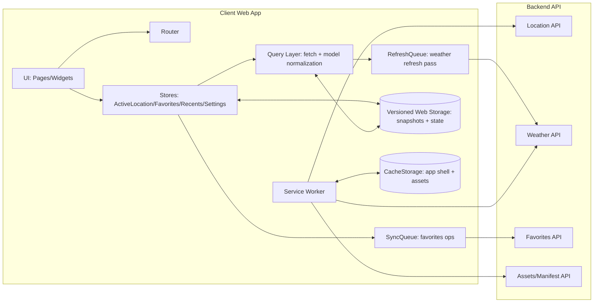
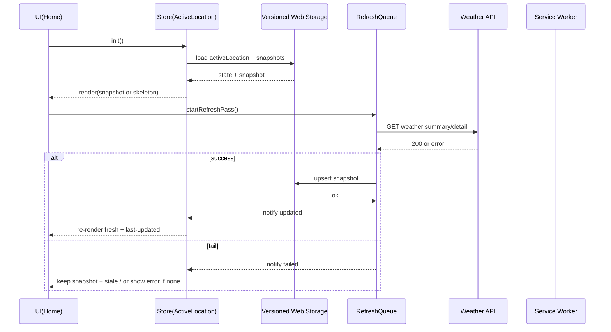
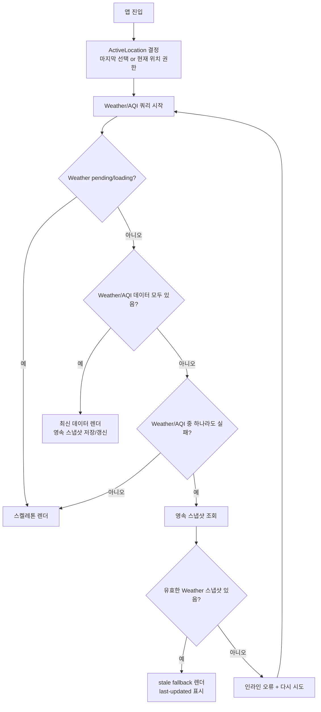

# Weatherpane 프로젝트 통합 개발자 명세서

## 경영 요약

Weatherpane는 **대한민국 지역을 중심으로** 사용자에게 “현재 위치(또는 선택한 위치)”의 날씨를 빠르게 제공하고, 오프라인·불안정 네트워크에서도 **영속 스냅샷(persisted snapshot)** 기반으로 **마지막 업데이트 시각/오래됨(stale)**을 정직하게 표시하는 것을 핵심 가치로 한다. 앱은 **홈(Active Location)**을 중심으로 **검색(Search)**, **상세(Weather Detail)**, **즐겨찾기(Favorites)**, **최근(Recents)**, **설정(Settings)**으로 구성되며, 정적 에셋(스케치)과 동적 데이터(날씨) 모두에 대해 **캐시/스냅샷/서비스워커**를 조합한 “즉시성 + 최신성” 균형을 목표로 한다. 서비스 워커는 웹 앱·브라우저·네트워크 사이의 프록시 역할로 오프라인 경험을 가능하게 한다. citeturn1search3

본 문서는 사용자와의 이전 대화에서 확정된 **Favorites UX 결정**(카드 스켈레톤/인라인 오류/재시도/비네비게이션/편집 모드/위·아래 버튼/닉네임 20자 하드캡 등)을 **“변경 금지(확정)”**로 고정하고, 그 외 화면/기능은 “MVP 가정(Assumptions)”과 “권장 설계(Recommendations)”를 명확히 구분해 개발자가 즉시 구현 가능한 수준의 **아키텍처·데이터 모델·API 계약·오프라인 전략·테스트 계획**을 통합한다. API 오류 포맷은 표준화된 Problem Details(RFC 9457)를 기본으로 하여 클라이언트/테스트/관측을 단순화한다. citeturn0search2

> **구현 상태: 정정.** 위 두 문단이 언급하는 **설정(Settings)** 화면은 구현됨(이슈 #77; `frontend/features/settings/`). **서비스워커** 기반 오프라인 프록시와 **RFC 9457** 오류 포맷은 미구현 — 차기 범위다(서비스워커 원 설계는 `docs/legacy/service-worker-caching-design.md` 참고). 실제 오류 포맷은 `/v1/*` 프록시가 반환하는 단순한 `{ code, message }` 구조다(`app/routes/v1.weather.core.ts`). 아래 각 절에서 항목별 구현 여부를 다시 표기한다.

---

## 제품 범위와 우선순위

### 제품 범위

Weatherpane의 기능 범위는 다음 8개 축으로 정리한다.

- **Home / Active Location**: 앱 진입 시 “현재 위치 또는 마지막 선택 위치”의 요약 카드 및 주요 탐색 허브.
- **Search**: 대한민국 위치를 빠르게 찾고, 선택 시 Active Location으로 전환.
- **Weather Detail**: 선택 위치의 상세 예보(시간별/일별)와 보조 지표(습도/풍속 등).
- **Favorites**: 자주 보는 위치를 저장/정렬/별칭(닉네임) 관리, 홈에서 빠르게 접근.
- **Recents**: 최근 조회한 위치 목록(즐겨찾기와 독립).
- **Settings**: 테마·온도 단위·동작 줄이기와 선택적 로컬 데이터 초기화.
- **Offline behavior**: 스냅샷 기반 렌더, stale/오프라인 표시, 실패 복구 UX.
- **Assets / Sketch pipeline**: 상태(맑음/비/눈 등)와 주야에 따른 스케치 키-에셋 매핑 및 캐시.

> **구현 상태:** Home/Search/Favorites/Recents/Settings는 구현됨(Settings는 이슈 #77). Weather Detail은 현재/시간별/일별 예보와 보조 지표까지 구현됨(일별 예보는 이슈 #87). Offline behavior는 API 실패 후 스냅샷 fallback + last-updated 배지 수준까지 구현됨 — 초기 pending 중 스냅샷 즉시 렌더와 서비스워커 기반 PWA 캐싱은 미구현(`docs/legacy/service-worker-caching-design.md` 참고).

### MVP 우선순위(권장)

| 우선순위 | 기능                   | MVP 목표                                               | 구현 상태                                                                                              | 비고                                            |
| -------- | ---------------------- | ------------------------------------------------------ | ------------------------------------------------------------------------------------------------------ | ----------------------------------------------- |
| P0       | Home/Active Location   | 즉시 렌더 + 스냅샷 fallback + stale 표시               | 부분 구현(API 실패 후 스냅샷 fallback + stale 표시는 구현, 초기 pending 중 스냅샷 즉시 렌더는 미구현)  | 오프라인 핵심                                   |
| P0       | Search                 | 위치 선택 → Active Location 전환 + Recents 기록        | 구현됨                                                                                                 | 로컬 대한민국 카탈로그 기반                     |
| P0       | Weather Detail         | 최소한 “현재/시간별/일별” 표시 + 오류/스켈레톤         | 구현됨(현재/시간별/일별 + 오류/스켈레톤; 일별 예보는 이슈 #87)                                         | 데이터 계약 필요                                |
| P0       | Favorites              | **확정 UX** 준수(편집/정렬, 위·아래, 스켈레톤/오류 등) | 구현됨                                                                                                 | 본 문서에서 고정                                |
| P1       | Settings               | 테마/단위/동작 줄이기 + 선택적 로컬 데이터 초기화      | 구현됨(이슈 #77; `frontend/features/settings/`)                                                        | 확인 뒤 Weatherpane 소유 데이터만 초기화        |
| P1       | Service Worker         | 앱 셸 precache + 런타임 캐시                           | 미구현 — 차기 범위(`docs/legacy/service-worker-caching-design.md`)                                     | PWA 캐싱 권장                                   |
| P2       | 원격 스케치 매니페스트 | 다음 세션에 적용되는 원격 오버라이드                   | 부분 구현(`/v1/assets/manifest`는 오버라이드 로직은 구현되어 있으나 현재 `{}` 반환 — 활성 데이터 없음) | 운영 편의                                       |
| P2       | 고급 오프라인 동기화   | Periodic Background Sync 등                            | 미구현 — 차기 범위                                                                                     | 브라우저 지원 고려 citeturn5search2turn5search6 |

### 명시적 전제(Assumptions)

아직 대화로 확정되지 않은 항목은 아래 전제로 두고, 실제 프로젝트 상황에 따라 조정한다.

- **백엔드 기술/호스팅**: 불명(REST 기준으로 계약 정의).
- **인증 방식**: Bearer token(OAuth2/OIDC 등) 가정. (마이페이지/멀티 디바이스 동기화가 필요할 때만 필수)
- **검색 데이터 소스**: (A) 로컬 내장 대한민국 지명 카탈로그(권장) 또는 (B) 서버/서드파티 지오코딩 API.
- **날씨 공급자**: (A) 자체 백엔드 집계(권장) 또는 (B) 클라이언트 직접 서드파티 호출(권장하지 않음: 키 노출/쿼터).
- **플랫폼**: 웹(PWA) 우선. 서비스 워커/Geolocation은 HTTPS 보안 컨텍스트 전제. citeturn1search3turn6search0

> **구현 상태(전제 → 실제):** 백엔드 기술/호스팅은 더 이상 불명이 아니다 — 별도의 자체 도메인 백엔드가 아니라 앱 자체 서버 라우트가 OpenWeather API를 프록시하는 구조로 확정되었다(아래 “날씨 공급자” 정정과 동일한 사실). 이 전제가 말하는 “REST 기준 계약”은 이 프록시가 아니라 별도로 구상했던 자체 도메인 REST 계약을 가리키며, “엔드포인트 목록(권장)” 절의 표와 마찬가지로 대부분 미구현 — 차기 범위로 남아 있다. 검색 데이터 소스는 (A) 로컬 카탈로그로 확정 구현됨(`AGENTS.md`: “Search is Korea-catalog-driven and instant”). 날씨 공급자는 (A)·(B) 어느 쪽도 아니라, **서버가 OpenWeather API 키를 숨기고 위치별 요청을 그대로 프록시**하는 방식으로 구현됨(자체 도메인 집계 백엔드 아님; `/v1/weather/core`, `/v1/weather/aqi`, `/v1/geocode` — `app/routes/v1.weather.core.ts`). 인증 방식(Bearer token/OAuth2)은 미구현 — 차기 범위(계정 기능 자체가 없음). 서비스 워커 전제는 미구현 — 차기 범위(`docs/legacy/service-worker-caching-design.md` 참고). Geolocation의 HTTPS 보안 컨텍스트 요구사항 자체는 유효하다.

---

## UX 결정과 화면 상태

### 확정 UX 결정 로그

아래 “확정” 항목은 이전 대화에서 합의된 Favorites 규칙으로, 변경 시 반드시 PR에서 명시적으로 재합의해야 한다.

| ID     | 결정(확정)                                                                                                                      | 근거                                        |
| ------ | ------------------------------------------------------------------------------------------------------------------------------- | ------------------------------------------- |
| FAV-01 | Favorites와 Recents는 **독립**이며 동일 위치가 양쪽에 존재 가능                                                                 | “저장한 장소” vs “최근 본 장소” 의미 분리   |
| FAV-02 | Favorite 카드 콘텐츠 계약(MVP): **스케치 + 표시명/닉네임 + 현재기온 + 상태문구 + 오늘 최저/최고 + last-updated/stale(필요 시)** | 카드 정보 밀도와 정직성 균형                |
| FAV-03 | **스냅샷 없음 + 로딩 중**: 카드 슬롯 유지, **스켈레톤** 표시                                                                    | 레이아웃 안정                               |
| FAV-04 | **스냅샷 없음 + 초기 실패**: 카드 슬롯 유지, **인라인 오류 상태** 표시                                                          | 전체 화면 실패로 확장 방지                  |
| FAV-05 | FAV-04 상태에서 **‘다시 시도’ 버튼** 제공                                                                                       | 회복 가능 UX                                |
| FAV-06 | FAV-04 상태에서는 **카드 네비게이션 불가**                                                                                      | 신뢰 가능한 표시 데이터 없음                |
| FAV-07 | 정렬은 포인터/터치 **드래그 핸들** + 접근성 대안 **‘위로/아래로’ 버튼**                                                         | 드래그 대안 요구에 부합 citeturn0search0 |
| FAV-08 | 드래그/위·아래/닉네임 편집은 **‘편집/정렬’ 모드에서만** 노출                                                                    | 기본 UI 단정                                |
| FAV-09 | 모드 진입/종료는 단일 토글: **‘편집’ ↔ ‘완료’**                                                                                 | MVP 단순성                                  |
| FAV-10 | ‘완료’ 탭 시 닉네임 편집 중이면 **auto-blur → 커밋 → 모드 종료**                                                                | 데이터 손실 방지                            |
| FAV-11 | 닉네임은 **20자 하드 캡**(초과 입력 불가)                                                                                       | 예측 가능 UX                                |
| FAV-12 | 즐겨찾기 카드 갱신 실패 시 **같은 패스에서 큐 레벨 추가 재시도 없음**                                                           | 폭주/불확실성 방지(결정성)                  |

### 전역 내비게이션 규칙(권장)

- 기본 라우트: `/`(Home), `/search`, `/favorites`, `/settings`, `/location/:resolvedLocationId`(`app/routes.ts`)
- Active Location 변경은 **사용자의 명시적 선택(검색/최근/즐겨찾기 클릭)**으로만 발생(권장).
  - 예외: 최초 실행에서 “현재 위치” 허용 시 Active Location을 현재 위치로 초기화.

### 화면별 렌더링 상태 매트릭스

#### Home / Active Location

| 상태             | 조건                                 | 표시                                      | 사용자 액션          |
| ---------------- | ------------------------------------ | ----------------------------------------- | -------------------- |
| 로딩 스켈레톤    | API 쿼리 pending/loading             | 큰 요약 스켈레톤 + 섹션 스켈레톤          | 대기                 |
| 스냅샷 fallback  | API 실패 + 유효한 영속 스냅샷 있음   | 마지막 업데이트 + stale/오프라인 배지     | 새로고침(선택)       |
| 온라인 갱신 실패 | 인메모리 쿼리 데이터 있음 + API 실패 | 기존 데이터 유지 + stale 강화             | 재시도/포커스 재진입 |
| 초기 실패        | API 실패 + 유효한 영속 스냅샷 없음   | 홈 상단 인라인 오류 + 재시도              | 재시도               |
| 위치 권한 거부   | Geolocation 거부                     | “위치 권한 필요” 안내 + 검색으로 이동 CTA | 검색 사용            |

Geolocation은 사용자 동의가 필요하며, 브라우저는 제공 전에 권한을 요청한다. citeturn6search0  
권한 상태 조회는 Permissions API의 `navigator.permissions.query()`로 일관된 UX를 구성할 수 있다. citeturn6search1turn6search12

#### Search

| 상태      | 조건                | 표시                             | 사용자 액션 |
| --------- | ------------------- | -------------------------------- | ----------- |
| 빈 입력   | q 없음              | 추천/최근/즐겨찾기 섹션(선택)    | 입력        |
| 결과 로딩 | 원격 검색(가정)     | 리스트 스켈레톤                  | 대기        |
| 결과 표시 | 로컬 또는 원격 결과 | 리스트 + 키보드 내비(↑↓/Enter)   | 선택        |
| 결과 없음 | 0건                 | “결과 없음”                      | 수정        |
| 선택 실패 | 위치 resolve 실패   | 선택 항목 인라인 오류(선택 유지) | 재선택      |

#### Weather Detail

| 상태             | 조건                                 | 표시                              |
| ---------------- | ------------------------------------ | --------------------------------- |
| 스켈레톤         | API 쿼리 pending/loading             | 현재/시간별 UI 스켈레톤           |
| 스냅샷 fallback  | API 실패 + 유효한 영속 스냅샷 있음   | 현재 날씨 요약 + last-updated     |
| 온라인 갱신 실패 | 인메모리 쿼리 데이터 있음 + API 실패 | 기존 상세 UI + 새로고침 실패 안내 |
| 초기 실패        | API 실패 + 유효한 영속 스냅샷 없음   | 풀페이지 오류 + 재시도            |

> **구현 상태: 구현됨.** 현재/시간별/일별 예보와 오류 상태가 모두 구현되어 있다(일별 예보는 이슈 #87). 섹션별(현재/시간별/일별) 스켈레톤은 어디에도 없으며, 로딩 중에는 페이지 레벨 `'loading'` 상태(`frontend/pages/location/ui/location-page.tsx`)가 전체 화면을 게이트한다 — 위 표의 "스켈레톤" 행은 이 페이지 레벨 로딩 상태를 가리킨다. 영속 fallback도 별도 상세 스냅샷이 아니라 현재 날씨 요약 스냅샷을 사용한다.

#### Favorites (모듈/섹션)

Favorites의 카드 상태는 “경영 요약”의 확정 규칙(FAV-03~06)을 그대로 따른다.

#### Recents

| 상태     | 조건      | 표시                 |
| -------- | --------- | -------------------- |
| 비어있음 | 기록 없음 | “최근 본 위치 없음”  |
| 목록     | 기록 있음 | 시간 역순 리스트     |
| 항목 탭  | 위치 선택 | Active Location 전환 |

### Favorites 접근성 대안의 정당성(근거)

드래그 기반 기능은 “드래깅 없이 단일 포인터로도 달성 가능”해야 하며(필수 예외: 드래그가 본질적), WCAG 2.2 성공 기준 2.5.7 취지에 따라 **위/아래 버튼**을 제공한다. citeturn0search0turn0search4

또한 키보드로 조작 가능해야 하므로(2.1.1), 편집 모드의 모든 조작은 Tab/Enter로 수행 가능해야 한다. citeturn2search2  
포커스 위치가 시각적으로 명확해야 하므로(2.4.7), 편집 모드에서 버튼/입력 포커스 링을 제거하지 않는다. citeturn2search3

---

## 아키텍처 및 컴포넌트 다이어그램

### 논리 아키텍처 개요

클라이언트는 “UI(렌더링) ↔ 도메인(상태/규칙) ↔ 데이터 접근(API/스토리지)”를 분리한다. MVP 단계의 영속 상태는 **기능별 버전드 Web Storage(localStorage/sessionStorage)** 로 관리하고, 오프라인·캐시 전략은 **(1) 명시적 영속 스냅샷 저장소** + **(2) 런타임 HTTP 캐시/서비스워커(성능/오프라인 보조)** 의 이중 구조로 설계한다.

- 서비스워커: 오프라인 경험/자산 업데이트/요청 가로채기. citeturn1search3
- Cache API/CacheStorage: 오프라인 에셋 저장 및 요청 커스터마이징. citeturn5search0turn5search4
- Web Storage: 기능별 키와 payload `version` 을 명시해 작은 영속 상태를 명확하게 관리한다.

> **구현 상태:** 위 “이중 구조” 중 (1) 명시적 영속 스냅샷 저장소(Web Storage)는 구현됨. (2) 런타임 HTTP 캐시/서비스워커는 미구현 — 차기 범위다(`docs/legacy/service-worker-caching-design.md` 참고). Cache API/CacheStorage도 같은 이유로 미구현이다.

### 주요 런타임 컴포넌트

- **Router**: 화면 전환과 URL 상태 — 구현됨
- **ActiveLocationStore**: 현재 선택 위치, 권한/초기화 상태 — 구현됨
- **WeatherQueryLayer**: 네트워크 fetch + 오류 정규화 + 모델 변환 — 구현됨(TanStack Query 기반, `frontend/features/weather-queries/`)
- **SnapshotRepository(Web Storage)**: 날씨/AQI 스냅샷 저장 — 구현됨. 원문은 “요약/상세” 축으로 서술되어 있었으나 실제 축은 Weather/AQI다(`frontend/shared/lib/storage/repositories/snapshot-repositories.ts`)
- **FavoritesStore**: 즐겨찾기 CRUD/정렬/닉네임 — 구현됨(로컬 `localStorage`만; `frontend/features/favorites/use-favorites.ts`). **SyncQueue + 서버 동기화(ETag 기반)**는 미구현 — 차기 범위(`docs/legacy/favorites-server-sync-design.md` 참고)
- **RefreshQueue(Weather)**: 화면 진입/포커스 등 트리거로 날씨 갱신 — 구현됨. 개념은 일치하나 `passId` 단위 실행이 아니라 concurrency=2 배치 refetch로 구현됨(`frontend/features/favorites/use-refresh-queue.ts`)
- **Service Worker**: 앱 셸 precache + 런타임 캐시(스케치/정적 리소스) — 미구현 — 차기 범위. 원래 설계는 `docs/legacy/service-worker-caching-design.md` 참고

### 컴포넌트 다이어그램(mermaid)

> **구현 상태:** 아래 다이어그램의 `SW`(Service Worker)/`Cache`(CacheStorage)/`Loc`(Location API)/`Fav`(Favorites API)/`SyncQ`(SyncQueue)는 미구현 — 차기 범위다. `Wx`(Weather API)는 자체 집계 백엔드가 아니라 서버가 프록시하는 OpenWeather 호출로 구현되어 있다(`/v1/weather/core`, `/v1/weather/aqi` — `app/routes.ts`). `Assets`(Manifest API)는 `/v1/assets/manifest`로 구현되어 있으나 현재 `{}`만 반환한다(부분 구현). 다이어그램 자체는 원래 설계를 보존하기 위해 수정하지 않는다.


```mermaid
flowchart LR
  subgraph Client[Client Web App]
    UI[UI: Pages/Widgets]
    Router[Router]
    Stores[Stores: ActiveLocation/Favorites/Recents/Settings]
    Query[Query Layer: fetch + model normalization]
    RefreshQ[RefreshQueue: weather refresh pass]
    SyncQ[SyncQueue: favorites ops]
    Persist[(Versioned Web Storage: snapshots + state)]
    SW[Service Worker]
    Cache[(CacheStorage: app shell + assets)]
  end

  subgraph API[Backend API]
    Loc[Location API]
    Wx[Weather API]
    Fav[Favorites API]
    Assets[Assets/Manifest API]
  end

  UI --> Router
  UI --> Stores
  Stores --> Query
  Query --> RefreshQ
  RefreshQ --> Wx
  Stores --> SyncQ
  SyncQ --> Fav
  Stores <--> Persist
  Query <--> Persist

  SW <--> Cache
  SW --> Wx
  SW --> Assets
  SW --> Loc
```

### 런타임 상호작용 시퀀스(mermaid)

> **구현 상태: 부분 구현.** 아래 시퀀스의 `W`(Service Worker) 참여자는 미구현 — 차기 범위다. 스냅샷을 먼저 로드해 즉시 렌더한 뒤 백그라운드에서 갱신하는 순서도 미구현이다. 실제 app-bootstrap 훅은 API 쿼리가 pending인 동안 `loading`을 반환하고, 성공 데이터를 스냅샷으로 저장하며, API 실패 후에만 영속 스냅샷을 읽어 fallback한다. 따라서 아래 다이어그램은 목표 흐름이며, 현재는 실패 후 fallback 경로만 구현되어 있다.


```mermaid
sequenceDiagram
  participant U as UI(Home)
  participant S as Store(ActiveLocation)
  participant D as Versioned Web Storage
  participant R as RefreshQueue
  participant A as Weather API
  participant W as Service Worker

  U->>S: init()
  S->>D: load activeLocation + snapshots
  D-->>S: state + snapshot
  S-->>U: render(snapshot or skeleton)

  U->>R: startRefreshPass()
  R->>A: GET weather summary/detail
  A-->>R: 200 or error
  alt success
    R->>D: upsert snapshot
    D-->>R: ok
    R-->>S: notify updated
    S-->>U: re-render fresh + last-updated
  else fail
    R-->>S: notify failed
    S-->>U: keep snapshot + stale / or show error if none
  end
```

---

## 데이터 모델·저장·동기화

### 저장소 선택과 근거

MVP 단계의 영속 상태는 **기능별 버전드 Web Storage** 를 표준으로 한다. `favorites`, `recents`, `active location`, `theme`, `settings`, `weather snapshots`, `AQI snapshots` 는 `localStorage` 에 저장하고, unsupported temp-route context 및 테마의 세션 미러는 세션 범위이므로 `sessionStorage` 에 저장한다. 각 저장소는 키 버전과 payload `version` 을 함께 사용하고, 파싱 실패 또는 버전 불일치 시 해당 기능 키를 안전하게 리셋한다. TanStack Query 캐시는 런타임 전용이며 세션 간 영속하거나 로컬 데이터 초기화 대상으로 취급하지 않는다.

> **구현 상태: 구현됨.** 위 문단은 실제 구현과 일치한다 — 버전드 `localStorage`/`sessionStorage`이며 IndexedDB가 아니다(`frontend/shared/lib/storage/browser-storage.ts`, `frontend/shared/lib/storage/repositories/`).

### 엔티티 목록

- `Location`: 위치 식별/표시명/좌표(선택) — 구현됨
- `ActiveLocationState`: 현재 선택 위치 + 선택 출처 + 마지막 전환 시각 — 구현됨
- `CurrentLocationRecoveryState`: 현재 위치 조회 실패 시 복구 사유(`permission-denied`, `position-unavailable`, `timeout`) — 구현됨
- `CoreWeather`: 쿼리/어댑터 계층이 반환하는 정규화된 핵심 날씨 모델 — 구현됨(`frontend/entities/weather/model/core-weather.ts`)
- `Aqi`: 쿼리/어댑터 계층이 반환하는 정규화된 AQI 모델 — 구현됨(`frontend/entities/aqi/model/aqi.ts`)
- `WeatherSummarySnapshot`: 날씨 스냅샷 — 구현됨(실제 타입명은 `PersistedWeatherSnapshot`, `frontend/entities/weather/model/persisted-weather-snapshot.ts`)
- `WeatherDetailSnapshot`: 상세 화면 전용 시간별/일별 영속 스냅샷 — 미구현. Detail 화면의 오프라인 폴백도 `WeatherSummarySnapshot`과 동일한 스냅샷을 재사용하며, 별도의 시간별/일별 영속 스냅샷은 없다(`frontend/features/app-bootstrap/use-detail-bootstrap.ts`)
- `Favorite`: 즐겨찾기 메타(닉네임, order) — 구현됨. 단, 실제 필드는 `locationId` 하나가 아니라 `location: ResolvedLocation` 전체를 포함한다(`frontend/entities/location/model/types.ts`의 `FavoriteLocation`; 아래 TypeScript 인터페이스 절 참고)
- `Recent`: 최근 조회 기록 — 구현됨. 단, 실제 필드는 `locationId`/`openCount`가 아니라 `location`/`lastOpenedAt`이며 `openCount`는 없다(`frontend/entities/location/model/types.ts`의 `RecentLocation`; `MAX_RECENTS = 10`)
- `Settings`: 온도 단위/동작 줄이기 설정 — 구현됨(이슈 #77). 단, 실제 타입명은 `Settings`가 아니라 `SettingsPreferences`이며 `temperatureUnit`/`motionPreference`만 포함한다(`frontend/features/settings/model/settings-repository.ts`). 테마(`system | light | dark`)는 별도로 `weatherpane.theme.v1`에 저장되며 이 인터페이스에 포함되지 않는다(`frontend/shared/lib/storage/repositories/theme-repository.ts`)
- `SyncOperation`: 즐겨찾기 변경사항 동기화 큐 — 미구현 — 차기 범위. 원래 설계는 `docs/legacy/favorites-server-sync-design.md` 참고

### TypeScript 인터페이스(예시)

아래 인터페이스는 저장 래퍼를 제외한 도메인 값 예시다. 실제 Web Storage payload는 `VersionedPayload<T>` 형태로 `version` 과 `data` 를 함께 저장한다.

> **구현 상태(코드 블록 내부, 항목별):** `WeatherSummarySnapshot`은 구현됨(실제 이름 `PersistedWeatherSnapshot`). `WeatherDetailSnapshot`은 미구현 — Detail 오프라인 폴백도 동일한 요약 스냅샷을 재사용한다. `CoreWeather`/`Aqi`는 구현됨이며 실제 `frontend/entities/weather/model/core-weather.ts`, `frontend/entities/aqi/model/aqi.ts`와 필드까지 일치한다. `Location`/`RawGpsFallbackLocation`/`CurrentLocationResult` 계열은 구현됨(`frontend/entities/location/model/types.ts`, 단 실제 타입명은 `ResolvedLocation`/`CatalogLocation` 등으로 세분화되어 있다).

```ts
export type ISODateTime = string;

export interface Location {
  locationId: string; // stable internal id
  name: string; // canonical display name
  admin1?: string; // 시/도
  admin2?: string; // 시/군/구
  lat?: number; // optional if resolved on server
  lon?: number;
  tz?: string; // default 'Asia/Seoul'
}

export type RawGpsFallbackReason = 'canonicalization-failed' | 'outside-korea';

export interface RawGpsFallbackLocation {
  kind: 'raw-gps';
  locationId: string; // gps:<lat4>:<lng4>
  name: '현재 위치';
  latitude: number;
  longitude: number;
  capturedAt: ISODateTime;
  fallbackReason: RawGpsFallbackReason;
}

export type CurrentLocationRecoveryReason =
  | 'permission-denied'
  | 'position-unavailable'
  | 'timeout';

export type CurrentLocationResult =
  | { kind: 'resolved'; location: ResolvedLocation }
  | { kind: 'raw-gps'; location: RawGpsFallbackLocation }
  | {
      kind: 'recovery-required';
      reason: CurrentLocationRecoveryReason;
    };

export interface WeatherSummarySnapshot {
  locationId: string;
  fetchedAt: ISODateTime; // client received time
  observedAt: ISODateTime; // provider observation time (or fetchedAt)
  temperatureC: number;
  conditionCode: string; // e.g., CLEAR, RAIN
  conditionText: string; // localized
  todayMinC: number;
  todayMaxC: number;
  source: { provider: string; modelVersion?: string };
}

export interface WeatherDetailSnapshot {
  locationId: string;
  fetchedAt: ISODateTime;
  current: {
    temperatureC: number;
    feelsLikeC?: number;
    humidityPct?: number;
    windMps?: number;
    precipitationMm?: number;
    uvIndex?: number;
    conditionCode: string;
    conditionText: string;
    sketchKey: string;
  };
  hourly: Array<{
    at: ISODateTime;
    temperatureC: number;
    popPct?: number;
    conditionCode: string;
  }>;
  daily: Array<{
    date: string;
    minC: number;
    maxC: number;
    conditionCode: string;
  }>;
}

export interface CoreWeather {
  locationId: string;
  fetchedAt: ISODateTime;
  observedAt: ISODateTime;
  current: {
    temperatureC: number;
    feelsLikeC?: number;
    humidityPct?: number;
    windMps?: number;
    precipitationMm?: number;
    uvIndex?: number;
    dewPointC?: number;
    condition: {
      code: string;
      text: string;
      isDay: boolean;
      visualBucket: 'clear' | 'cloudy' | 'rainy' | 'snowy';
      textMapping: {
        conditionCode: string;
        isDay: boolean;
        precipitationKind: 'none' | 'rain' | 'snow';
        cloudCoverPct: number;
        intensity: 'none' | 'light' | 'moderate' | 'heavy';
      };
    };
  };
  today: {
    minC: number;
    maxC: number;
  };
  hourly: Array<{
    at: ISODateTime;
    temperatureC: number;
    popPct: number;
    condition: CoreWeather['current']['condition'];
  }>;
  source: { provider: string; modelVersion?: string };
}

export interface Aqi {
  locationId: string;
  fetchedAt: ISODateTime;
  observedAt: ISODateTime;
  summary: {
    aqi: number;
    category: 'good' | 'fair' | 'moderate' | 'poor' | 'very-poor';
  };
  pollutants: {
    co: number;
    no2: number;
    o3: number;
    pm10: number;
    pm25: number;
    so2: number;
    nh3?: number;
  };
  source: { provider: string; modelVersion?: string };
}
```

현재 위치 서비스는 `getCurrentPosition()` 기반의 1회 조회만 수행한다. 성공 시 역매핑으로 지원되는 한국 canonical 위치를 `dong > gu/gun > si/do` 순서로 시도하고, canonicalization에 실패하면 raw GPS fallback을 만든다. `fallbackReason: 'outside-korea'` 인 raw GPS 위치는 조회는 가능하지만 즐겨찾기 저장 대상이 아니다. persisted active location이 이미 복원된 경우에는 현재 위치를 백그라운드에서 조용히 다시 조회하지 않는다.

### Favorites / Recents / Settings 모델

> **구현 상태:** 아래 예시는 현재 구현 타입과 필드를 따른다. `FavoriteLocation`과 `RecentLocation`은 `frontend/entities/location/model/types.ts`, `SettingsPreferences`는 `frontend/features/settings/model/settings-repository.ts`에 정의되어 있다. 테마는 `SettingsPreferences`에 포함되지 않고 `ThemePreference`로 분리되어 `weatherpane.theme.v1`에 저장된다(`frontend/shared/lib/storage/repositories/theme-repository.ts`). 최근 위치는 최대 10개다(`MAX_RECENTS = 10`).

```ts
export interface FavoriteLocation {
  favoriteId: string;
  location: ResolvedLocation;
  nickname: string | null;
  order: number;
  createdAt: ISODateTime;
  updatedAt: ISODateTime;
}

export interface RecentLocation {
  location: ResolvedLocation | RawGpsFallbackLocation;
  lastOpenedAt: ISODateTime;
}

export type TemperatureUnit = 'C' | 'F';
export type MotionPreference = 'system' | 'reduced' | 'full';

export interface SettingsPreferences {
  temperatureUnit: TemperatureUnit;
  motionPreference: MotionPreference;
}

export type ThemePreference = 'system' | 'light' | 'dark';
```

### Settings 계약

- 테마는 `weatherpane.theme.v1`에 `system | light | dark`로 저장한다. `system`은
  현재 시스템 색상 설정과 실행 중 변경을 따르며, `light`와 `dark`의 명시적
  선택은 시스템 변경을 따르지 않는다.
- 비테마 설정은 `weatherpane.settings.v1`에 `temperatureUnit`과
  `motionPreference`를 버전 관리된 payload로 저장한다. 온도 단위는 `C | F`이며
  기본값은 `C`다. 날씨와 스냅샷의 정규화 값은 섭씨로 유지하고, 표시 경계에서만
  `F = C × 9 / 5 + 32`로 변환한 뒤 한 번 반올림한다.
- 동작 줄이기는 `system | reduced | full`이다. `system`은 실행 중 시스템의
  `prefers-reduced-motion` 변경을 따르고, `reduced`는 항상 줄이며, `full`은
  시스템 설정과 관계없이 전체 동작을 허용한다.
- 로컬 데이터 초기화는 확인을 거쳐야 하며 취소하면 어떤 값도 변경하지 않는다.
  확인 뒤 `weatherpane.active-location.v1`, `weatherpane.aqi-snapshots.v1`,
  `weatherpane.favorites.v1`, `weatherpane.recents.v1`,
  `weatherpane.settings.v1`, `weatherpane.theme.v1`,
  `weatherpane.weather-snapshots.v1`의 localStorage 값과
  `weatherpane.theme.v1`, `weatherpane.unsupported-route-context.v1`의
  sessionStorage 값만 개별 삭제한다. 비관련 키는 보존한다.
- 모든 삭제가 성공하면 페이지를 다시 불러와 기본 설정과 마운트된 상태를
  일치시킨다. 하나라도 실패하면 초기화 대화상자를 유지하고 명시적 오류를
  표시하며 다시 불러오지 않는다.

### 로컬 저장 키 스키마(권장)

| 저장소                           | 키                                         | 저장 매체        | 주요 필드                                      |
| -------------------------------- | ------------------------------------------ | ---------------- | ---------------------------------------------- |
| `active location`                | `weatherpane.active-location.v1`           | `localStorage`   | `location, source, changedAt`                  |
| `weather snapshots`              | `weatherpane.weather-snapshots.v1`         | `localStorage`   | `Record<locationId, PersistedWeatherSnapshot>` |
| `AQI snapshots`                  | `weatherpane.aqi-snapshots.v1`             | `localStorage`   | `Record<locationId, PersistedAqiSnapshot>`     |
| `favorites`                      | `weatherpane.favorites.v1`                 | `localStorage`   | `FavoriteLocation[]`                           |
| `recents`                        | `weatherpane.recents.v1`                   | `localStorage`   | `Recent[]`                                     |
| `theme`                          | `weatherpane.theme.v1`                     | `localStorage`   | `"system" \| "light" \| "dark"`                |
| `settings`                       | `weatherpane.settings.v1`                  | `localStorage`   | `temperatureUnit, motionPreference`            |
| `unsupported temp-route context` | `weatherpane.unsupported-route-context.v1` | `sessionStorage` | `Record<token, UnsupportedRouteContext>`       |

### 예시 JSON

#### persisted summary snapshot

> **구현 상태: 구현됨.** 아래 필드 구조는 실제 `PersistedWeatherSnapshot`과 정확히 일치한다(`frontend/entities/weather/model/persisted-weather-snapshot.ts`; `frontend/entities/weather/model/core-weather-to-snapshot.ts`). 실제 저장 키는 `weatherpane.weather-snapshots.v1`이며 `Record<locationId, PersistedWeatherSnapshot>` 형태로 저장된다(위 “로컬 저장 키 스키마” 표 참고).

```json
{
  "version": 1,
  "data": {
    "locationId": "loc_3f2c1a8b",
    "fetchedAt": "2026-04-10T08:12:31+09:00",
    "observedAt": "2026-04-10T08:00:00+09:00",
    "temperatureC": 13.4,
    "conditionCode": "CLOUDY",
    "conditionText": "흐림",
    "todayMinC": 9.0,
    "todayMaxC": 17.0,
    "source": { "provider": "ACME_WEATHER", "modelVersion": "2026.03" }
  }
}
```

#### favorites list payload

> **구현 상태: 구현됨.** 아래 구조는 실제 `FavoriteLocation`(`frontend/entities/location/model/types.ts`)과 일치한다.

```json
{
  "version": 1,
  "data": [
    {
      "favoriteId": "fav_a",
      "location": {
        "kind": "resolved",
        "locationId": "loc_3f2c1a8b",
        "catalogLocationId": "catalog:seoul-jongno",
        "name": "서울 종로구",
        "admin1": "서울특별시",
        "admin2": "종로구",
        "latitude": 37.5729,
        "longitude": 126.9794,
        "timezone": "Asia/Seoul"
      },
      "nickname": "회사",
      "order": 0,
      "createdAt": "2026-03-01T10:00:00+09:00",
      "updatedAt": "2026-04-10T08:10:00+09:00"
    }
  ]
}
```

### 동기화 큐와 충돌 해결

> **구현 상태: 미구현 — 차기 범위.** 전체 설계는 `docs/legacy/favorites-server-sync-design.md` 참고.

#### “같은 패스에서 추가 재시도 금지”(FAV-12) 구현 힌트

> **구현 상태: 구현됨.** 개념 일치, 실제 구현은 `frontend/features/favorites/use-refresh-queue.ts`의 concurrency=2 배치 refetch — passId/markFailed 없이 `Promise.allSettled`로 동일 효과를 냄.

```ts
// RefreshQueue는 "passId" 단위로 실행한다.
// 한 pass에서 locationId별 refresh 실패 시, 즉시 재큐잉하지 않는다.
function runRefreshPass(passId, locationIds) {
  for (const id of locationIds) {
    tryRefreshOne(id).catch((err) => {
      markFailed(passId, id, err);
      // IMPORTANT: do NOT enqueue again in this pass
    });
  }
}
```

---

## API 계약·오류·재시도

### 오류 포맷: RFC 9457 Problem Details

RFC 9457은 HTTP API 오류를 기계가 읽을 수 있는 표준 구조로 전달하기 위한 “problem detail” 포맷을 정의하며 RFC 7807을 대체한다. citeturn0search2turn0search6

> **구현 상태: 미구현 — 차기 범위.** 실제 `/v1/*` 프록시는 RFC 9457이 아니라 단순한 `{ code, message }` 형태의 오류를 반환한다(`app/routes/v1.weather.core.ts`). 아래 스키마는 원래 권장 설계로 남겨둔다.

권장 기본 스키마(확장 필드 포함):

```json
{
  "type": "https://api.weatherpane.app/problems/validation-error",
  "title": "Validation error",
  "status": 422,
  "detail": "nickname must be <= 20 characters",
  "instance": "/v1/favorites/fav_a",
  "code": "FAV_NICKNAME_TOO_LONG",
  "retryable": false,
  "fields": [{ "name": "nickname", "reason": "maxLength", "limit": 20 }]
}
```

### 엔드포인트 목록(권장)

| 도메인       | Method | Path                                    | 목적                    | 캐시/조건부             | 구현 상태                                                                                               |
| ------------ | ------ | --------------------------------------- | ----------------------- | ----------------------- | ------------------------------------------------------------------------------------------------------- |
| Locations    | GET    | `/v1/locations/:locationId`             | 위치 메타 조회          | ETag/If-None-Match 가능 | 미구현 — 차기 범위                                                                                      |
| Search(선택) | GET    | `/v1/locations/search?q=`               | 원격 검색(가정)         | 캐시 짧게               | 미구현 — 차기 범위(실제 검색은 로컬 카탈로그 기반)                                                      |
| Weather      | GET    | `/v1/weather/summary?locationId=`       | 홈/카드 요약            | ETag 가능(선택)         | 미구현 — 차기 범위                                                                                      |
| Weather      | GET    | `/v1/weather/detail?locationId=`        | 상세(시간/일)           | ETag 가능(선택)         | 미구현 — 차기 범위                                                                                      |
| Weather      | GET    | `/v1/weather/summaries?locationIds=...` | 즐겨찾기 배치 요약      | 배치 사이즈 제한        | 미구현 — 차기 범위                                                                                      |
| Favorites    | GET    | `/v1/favorites`                         | 즐겨찾기 목록           | **ETag 필수**           | 미구현 — `docs/legacy/favorites-server-sync-design.md` 참고                                             |
| Favorites    | POST   | `/v1/favorites`                         | 추가                    | 컬렉션 ETag 갱신        | 미구현 — 상동                                                                                           |
| Favorites    | PATCH  | `/v1/favorites/:favoriteId`             | 닉네임 수정             | **If-Match 필수**       | 미구현 — 상동                                                                                           |
| Favorites    | DELETE | `/v1/favorites/:favoriteId`             | 삭제                    | **If-Match 필수**       | 미구현 — 상동                                                                                           |
| Favorites    | PUT    | `/v1/favorites/reorder`                 | 정렬 저장               | **If-Match 필수**       | 미구현 — 상동                                                                                           |
| Assets       | GET    | `/v1/assets/manifest`                   | 스케치 매니페스트(선택) | ETag/Cache-Control      | 구현됨(`app/routes/v1.assets.manifest.ts`) — 단, ETag/Cache-Control 조건부 요청은 없고 현재 `{}`만 반환 |

> **구현 상태: 이 표는 “권장(recommended)” 설계이며 대부분 미구현이다.** 실제로 구현된 것은 이 표가 그리는 자체 도메인 백엔드가 아니라, OpenWeather를 그대로 얇게 감싸는 per-request 프록시다: `/v1/weather/core`(One Call 프록시), `/v1/weather/aqi`(Air Pollution 프록시), `/v1/geocode`(지오코딩 프록시)(`app/routes.ts`). 이 프록시들은 클라이언트의 쿼리 레이어가 호출하며, 오류는 위 RFC 9457이 아니라 단순한 `{ code, message }` 형태로 반환한다(`app/routes/v1.weather.core.ts`). 즐겨찾기 CRUD 행(GET/POST/PATCH/DELETE/PUT)은 `docs/legacy/favorites-server-sync-design.md` 참고.

PATCH는 리소스의 부분 수정을 위한 HTTP 메서드로 RFC 5789에 정의되어 있다. citeturn1search1

### 조건부 요청(ETag / If-None-Match / If-Match)

- If-None-Match는 GET/HEAD에서 ETag 불일치 시에만 200을 반환하며, 조건 실패 시 304 Not Modified를 반환해야 한다. citeturn7search1turn7search4
- 서버 변경을 적용하는 메서드에서 조건 실패는 412 Precondition Failed로 응답할 수 있다. citeturn7search1turn7search0
- HTTP 의미/아키텍처는 RFC 9110이 정리한다(참조). citeturn7search2

> **구현 상태: 미구현 — 차기 범위.** 위 조건부 요청 의미는 일반 HTTP 표준 설명이며, Weatherpane API 레이어에는 적용되어 있지 않다. 실제 `/v1/*` 프록시는 ETag/If-None-Match/If-Match를 사용하지 않는다.

### 재시도/레이트리밋

- 429 Too Many Requests는 “주어진 시간에 너무 많은 요청”을 의미하며, 응답에 Retry-After를 포함할 수 있다. citeturn1search2turn1search6
- Retry-After 헤더는 다음 요청까지 대기해야 하는 시간을 나타낸다(대표 사례: 503 등). citeturn0search5

권장 재시도 규칙(클라이언트):

> **구현 상태: 대부분 미구현 — 차기 범위.** 실제 클라이언트 재시도는 오류 종류와 무관하게 TanStack Query의 `retry: 1`(기본 지수 백오프, 커스텀 지터 없음)이 균일 적용된다(HTTP status로 분기하지 않음) — `frontend/features/weather-queries/weather-query-options.ts`의 `QUERY_RETRY`는 숫자 그대로 전달되고, `frontend/shared/api/real-weather-provider.ts`의 `fetchProxy`는 4xx/5xx를 구분하지 않고 모든 비정상 응답에 동일한 `WeatherProviderError`를 던진다. 즉 4xx도 다른 오류와 마찬가지로 1회 재시도되며, 429/503의 `Retry-After` 준수나 Favorites 412 리베이스는 구현되어 있지 않다. 아래는 원래 권장 설계다.

- GET Weather:
  - 네트워크 오류/타임아웃: **1회 재시도**(지수 백오프 + 지터) — 미구현 — 차기 범위
  - 429/503: Retry-After 있으면 준수 후 1회 재시도 — 미구현 — 차기 범위
  - 4xx(인증/검증): 자동 재시도 금지 — 미구현 — 차기 범위
- Favorites Sync:
  - 412(ETag 불일치): 즉시 목록 재조회 후 리베이스/재시도(자동 1회) — 미구현 — 차기 범위(서버 동기화 자체가 없음, `docs/legacy/favorites-server-sync-design.md` 참고)
  - 409(중복): 성공 처리(멱등) 또는 사용자 피드백 — 미구현 — 차기 범위
- **중요:** Favorites 카드 새로고침 실패는 같은 패스에서 큐 레벨로 추가 재시도 금지(FAV-12) — 구현됨(`frontend/features/favorites/use-refresh-queue.ts`)

---

## 오프라인·캐시·서비스워커 전략

### 스테일(stale) 및 last-updated 규칙(권장 기본값)

Weatherpane는 “스냅샷 즉시 제공 + 백그라운드 갱신”을 목표 UX로 한다. HTTP 캐시 확장인 stale-while-revalidate는 백그라운드 재검증 동안 오래된 응답을 제공하는 개념을 정의한다. citeturn1search0turn0search7

> **구현 상태: 부분 구현 및 정책 축 정정.** 아래는 원래 “Summary/Detail” 축으로 서술되어 있었으나 실제 구현에는 그런 축이 없다. 실제 축은 Weather(핵심 날씨)/AQI이며, `AGENTS.md`의 Query and persistence rules와 `frontend/features/app-bootstrap/snapshot-cutoff.ts`가 단일 출처다. staleTime과 실패 후 스냅샷 fallback은 구현되어 있지만, 초기 pending 중 영속 스냅샷을 즉시 렌더하고 백그라운드에서 갱신하는 순서는 미구현이다.

실제 정책(구현됨):

- staleTime: Weather(핵심 날씨) 10분, AQI 30분(`frontend/features/weather-queries/weather-query-options.ts:7-8`)
- retry: 1회
- refetch: 포커스 시 stale한 경우에만 재조회(TQ v5 `refetchOnWindowFocus: true`; `'if-stale'`는 v5에서 제거됨)
- 스냅샷 fallback cutoff: Weather 24시간, AQI 12시간(`frontend/features/app-bootstrap/snapshot-cutoff.ts:2-3`의 `isWeatherSnapshotFresh`/`isAqiSnapshotFresh`가 단일 출처)

> **참고:** 즐겨찾기 카드에는 이와 별도로 60분 임계값의 “매우 오래됨” 배지가 있다 — `frontend/pages/favorites/ui/favorite-card.tsx`의 `VERY_STALE_MS = 60 * 60_000`으로 구현되어 있으며, 이는 위 시스템 전역 staleTime과는 다른 축이다. `docs/specs-favorites.md`가 이 값의 정본이다. “Detail 48시간”이라는 별도 cutoff는 위 “Summary/Detail” 축(정정됨)의 잔재로, 실제 구현에는 존재하지 않으므로 제거한다.

last-updated 표시 규칙 예:

> **구현 상태: 구현됨.** Home/Detail 화면에서 `frontend/shared/ui/last-updated.tsx`로 구현되어 있다.

- 1분 미만: “방금”
- 1~59분: “N분 전”
- 1~23시간: “N시간 전”
- 그 이상: “YYYY.MM.DD HH:mm”

### 서비스워커 캐싱 전략

서비스 워커는 아직 구현되지 않았다(미구현 — 차기 범위). 원래 설계는 `docs/legacy/service-worker-caching-design.md` 참고.

### 초기 로드 및 재시도 플로우(mermaid)

> **구현 상태: 부분 구현.** app-bootstrap 훅(`frontend/features/app-bootstrap/use-home-bootstrap.ts`, `use-detail-bootstrap.ts`)은 API 쿼리를 먼저 시작하고 pending 중에는 `loading`을 반환한다. 성공하면 최신 데이터를 렌더하고 영속 스냅샷을 저장하며, API 실패 후에만 유효한 영속 스냅샷을 읽어 fallback한다. 따라서 실패 후 스냅샷 유지/인라인 오류는 구현되어 있지만, 스냅샷 즉시 렌더 → 백그라운드 갱신 순서는 미구현이다.


```mermaid
flowchart TD
  A[앱 진입] --> B[ActiveLocation 결정<br/>마지막 선택 or 현재 위치 권한]
  B --> C[Weather/AQI 쿼리 시작]
  C --> D{Weather pending/loading?}
  D -->|예| E[스켈레톤 렌더]
  D -->|아니오| F{Weather/AQI 데이터 모두 있음?}
  F -->|예| G[최신 데이터 렌더<br/>영속 스냅샷 저장/갱신]
  F -->|아니오| H{Weather/AQI 중 하나라도 실패?}
  H -->|아니오| E
  H -->|예| I[영속 스냅샷 조회]
  I --> J{유효한 Weather 스냅샷 있음?}
  J -->|예| K[stale fallback 렌더<br/>last-updated 표시]
  J -->|아니오| L[인라인 오류 + 다시 시도]
  L --> C
```

---

## 접근성·보안/프라이버시·관측·거버넌스·테스트 및 체크리스트

### 접근성 요구사항

접근성은 entity["organization","W3C","web standards org"] WCAG 2.2를 기준으로 “최소 AA”를 목표로 한다. WCAG 2.2 표준 본문은 2.5.7 Dragging Movements(AA) 등 신규 기준을 포함한다. citeturn0search4turn0search4

필수 요구(요약):

- **드래그 대안 제공(2.5.7)**: Favorites 정렬은 위/아래 버튼으로 대체 가능해야 한다. citeturn0search0
- **키보드 조작(2.1.1)**: 모든 기능은 키보드로 조작 가능해야 한다. citeturn2search2
- **포커스 가시성(2.4.7)**: 키보드 포커스가 명확히 보여야 한다. citeturn2search3
- **재정렬 버튼 패턴 참고**: WAI-ARIA APG의 “rearrangeable listbox” 예시는 버튼 기반 이동과 키보드 상호작용 설계에 참고가 된다. citeturn2search1

Favorites 편집 모드의 접근성 이름(권장):

- “즐겨찾기 {표시명} 위로 이동”
- “즐겨찾기 {표시명} 아래로 이동”
- “{표시명} 날씨 다시 시도”

### 보안/프라이버시

- Geolocation은 사용자 동의가 필요하며, 개인정보 보호를 위해 브라우저가 권한 확인을 수행한다. citeturn6search0
- 로그아웃/계정 전환 시 로컬 데이터 제거를 위해 Clear-Site-Data를 사용할 수 있으며, 캐시/쿠키/저장소(localStorage/sessionStorage 포함) 삭제를 브라우저에 지시할 수 있다. citeturn6search2
- 서비스워커/CacheStorage/Geolocation 등은 보안 컨텍스트(HTTPS) 요구가 있으므로 배포 파이프라인에서 HTTPS를 전제한다. citeturn1search3turn5search0turn6search0
- API 오류 응답(RFC 9457)의 `detail`에 **주소/좌표 등 민감정보를 포함하지 않는다**. citeturn0search2

> **구현 상태:** Geolocation 동의 요구사항(1번째 항목)은 실제로 유효하다(HTTPS 전제 포함). 나머지는 미구현 — 차기 범위다: 계정/로그아웃 기능이 없어 Clear-Site-Data 항목은 적용 대상이 없고, 서비스워커/CacheStorage는 만들어진 적이 없으며(`docs/legacy/service-worker-caching-design.md` 참고), 오류 포맷은 RFC 9457이 아니라 `{ code, message }`다(단, “민감정보를 응답에 포함하지 않는다”는 원칙 자체는 여전히 유효하다).

### 텔레메트리/메트릭(권장)

> **구현 상태: 미구현 — 차기 범위.** 코드베이스에 텔레메트리/분석 이벤트 전송 로직이 존재하지 않는다. 아래는 향후 계측 설계 초안이다.

측정 목표는 “사용자 체감(속도/안정성) + 운영 품질(오류율/지연) + 기능 사용성(검색/즐겨찾기 전환)”이다.

핵심 이벤트(예시):

- 화면: `home_view`, `search_view`, `detail_view`, `settings_view`
- 성능: `snapshot_render_time_ms`, `api_latency_ms`
- 오류: `api_error`(status/code/retryable), `offline_exposed`
- 기능: `active_location_change`(source: search|favorite|recent|geo), `favorite_reorder`(method: drag|updown), `favorite_rename_commit`(method: blur|enter|done)
- 품질: `favorite_card_state`(fresh|stale|error|skeleton)

### CI/CD 및 레포 거버넌스

브랜칭은 entity["company","GitLab","devops platform company"] Flow의 “모두 main에서 시작해 main으로 합치기(짧은 feature branch, 모든 커밋 테스트, rebase 금지 등)”를 GitHub에서 운영하는 형태를 권장한다. citeturn4search1turn4search0  
PR/이슈 템플릿, CODEOWNERS, 보호 브랜치는 entity["company","GitHub","code hosting platform"] 문서의 기능(템플릿/코드오너/보호 브랜치)로 강제할 수 있다. citeturn3search2turn3search1turn3search3

에이전트 규칙은 entity["company","OpenAI","ai research company"] Codex 문서의 AGENTS.md 사용 가이드를 근거로 “프로젝트 규칙을 파일로 고정”하고, 하위 폴더에서 오버라이드하는 계층형 운영을 권장한다. citeturn3search4  
추가로 AGENT.md 표준 제안(참고)을 통해 “에이전트 구성 파일”의 목적과 구조를 이해할 수 있다. citeturn3search0

### 구현 체크리스트(요약)

- [ ] UI
  - [x] Home/Search/Favorites/Recents/Settings의 스켈레톤/오류/stale 상태 구현 — 구현됨(Settings는 이슈 #77)
  - [x] Detail 상태 완성 — 현재/시간별/일별 표시, 로딩/오류, 현재 날씨 요약 stale fallback — 구현됨(일별 예보는 이슈 #87)
  - [x] Favorites “편집/정렬” 모드 토글, 위/아래 버튼, 닉네임 20자 하드캡, 완료 auto-blur 커밋 — 구현됨
- [x] 데이터
  - [x] 버전드 Web Storage 키/payload `version` 관리 — 구현됨(`frontend/shared/lib/storage/`)
  - [x] 스냅샷 저장/로드 및 staleness 판정 로직 — 구현됨(`frontend/features/app-bootstrap/snapshot-cutoff.ts`)
  - [x] Recents 기록(즐겨찾기와 독립) — 구현됨(`frontend/features/recents/`)
- [ ] 네트워크/동기화
  - [ ] RFC 9457 오류 파서 + 표준화된 error handling — 미구현 — 차기 범위(실제는 `{ code, message }`)
  - [ ] Favorites 동기화: ETag/If-Match, 412 리베이스 흐름 — 미구현 — 차기 범위(`docs/legacy/favorites-server-sync-design.md` 참고)
  - [x] RefreshQueue 단위 패스 실행 + “같은 패스 재시도 금지” — 구현됨(개념 일치, concurrency=2 배치 refetch로 구현; `frontend/features/favorites/use-refresh-queue.ts`)
- [ ] 오프라인
  - [ ] 서비스워커 설치/업데이트/캐시 버전 관리 — 미구현 — 차기 범위(`docs/legacy/service-worker-caching-design.md` 참고)
  - [x] API 실패 시 스냅샷 fallback, 오프라인 배지 표시 — 구현됨
- [x] 접근성
  - [x] 키보드 조작/포커스 링/스크린리더 라벨 점검(2.1.1/2.4.7/2.5.7) — 구현됨

### 테스트 계획과 대표 케이스

| 레벨        | 케이스                       | 기대                                      | 구현 상태                                                                                                                                                                                                       |
| ----------- | ---------------------------- | ----------------------------------------- | --------------------------------------------------------------------------------------------------------------------------------------------------------------------------------------------------------------- |
| Unit        | staleness 판정(경계값)       | 10분/60분 등 경계 정확                    | 구현됨(즐겨찾기 카드 배지 경계 — `frontend/pages/favorites/ui/favorite-card.tsx`의 `CORE_WEATHER_STALE_TIME`/`VERY_STALE_MS`; 시스템 전역 staleTime 경계는 10분/30분, 위 “스테일 및 last-updated 규칙” 절 참고) |
| Unit        | Favorites 닉네임 20자 하드캡 | 21자 입력 불가                            | 구현됨                                                                                                                                                                                                          |
| Unit        | ‘완료’ auto-blur 커밋        | 커밋 후 모드 종료                         | 구현됨                                                                                                                                                                                                          |
| Integration | 스냅샷 없음 + 초기 실패      | 인라인 오류 + 다시 시도, 비네비           | 구현됨                                                                                                                                                                                                          |
| Integration | 스냅샷 있음 + 갱신 실패      | 스냅샷 유지 + stale 표시                  | 구현됨                                                                                                                                                                                                          |
| Integration | RefreshQueue 정책            | 같은 패스에서 실패 항목 재큐잉 없음       | 구현됨(concurrency=2 배치 refetch로 구현)                                                                                                                                                                       |
| Integration | Favorites 412 충돌           | 재조회 → 리베이스 → 재시도 성공           | 미구현 — 차기 범위(서버 동기화 없음; `docs/legacy/favorites-server-sync-design.md` 참고)                                                                                                                        |
| E2E         | Search → Select → Detail     | ActiveLocation 전환 + Recents 기록        | 구현됨                                                                                                                                                                                                          |
| E2E         | Favorites 편집/정렬          | 위/아래/드래그 동작 + 저장                | 구현됨                                                                                                                                                                                                          |
| E2E         | 오프라인 모드                | 스냅샷 렌더 + 오프라인 배지               | 구현됨(서비스 워커 없이 스냅샷 fallback + online/offline 이벤트 수준)                                                                                                                                           |
| A11y        | 키보드 전 기능 조작          | Tab/Enter만으로 가능 citeturn2search2  | 구현됨                                                                                                                                                                                                          |
| A11y        | 드래그 대안 제공             | 위/아래로 재정렬 가능 citeturn0search0 | 구현됨                                                                                                                                                                                                          |

이 명세는 “확정 항목(Favorites)”과 “가정/권장 항목(그 외)”을 분리했으며, 실제 구현 착수 시 **가정 항목**은 첫 스프린트에서 빠르게 확정(또는 축소)하는 것을 권장한다.
